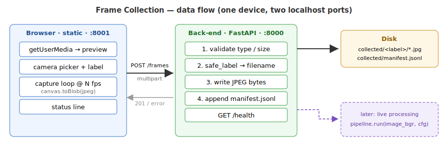

# Design — Finish-Line Video/Frame Collection App

Companion to `requirements.md`. Fixes the **tech stack**, the **architecture**, and the
**frozen contracts** (HTTP API, on-disk layout, back-end module signatures) that the
front-end and back-end tasks code against in parallel. Shows how this MVP extends to the
**live-processing** phase that reuses the existing CV pipeline.

---

## 1. Design Philosophy

- **Collection and analysis share one data format.** A collected frame is exactly what
  the POC pipeline consumes: a standard JPEG that `cv2.imread` decodes to a BGR array.
  We are not inventing a bespoke format — we are populating the pipeline's input (G4/A6).
- **Store now, process later — but on the same rails.** This iteration only writes frames
  to disk. The back-end is structured so that "write to disk" is one **sink**; a later
  sink calls `rider_id.pipeline.run(image_bgr, cfg)` on the same received frame (§8).
- **Static front-end, small back-end.** No front-end build step (plain HTML/JS/CSS,
  browser-native APIs). The back-end is a thin HTTP service whose only job is validate →
  store → record. Everything runs on one laptop.
- **Isolate the two contract surfaces** — the **HTTP API** and the **on-disk layout** —
  and freeze them, so the front-end agent and back-end agent build against fixed
  boundaries without collisions.

---

## 2. Tech Stack

| Concern | Choice | License | Why |
|---|---|---|---|
| Front-end | **Vanilla HTML + JS + CSS** (no framework, no build) | — | "Static site" (NFR4). Browser APIs cover everything; nothing to compile or bundle. |
| Camera capture | **`navigator.mediaDevices.getUserMedia` + `<canvas>`** | — | Native camera access + `enumerateDevices` for camera selection (FR1–FR2); `canvas.toBlob('image/jpeg')` encodes frames. |
| Frame transport | **`fetch` POST `multipart/form-data`** (`FormData`) | — | One request per frame; image + metadata fields in one body. Simple, debuggable with `curl`. |
| Back-end | **FastAPI + Uvicorn** (Python 3.12) | MIT / BSD | Matches the repo's Python 3.12 CV env, so the later live-processing sink can import `rider_id` directly. Async I/O, built-in validation, trivial multipart + CORS. |
| Multipart parsing | **python-multipart** | Apache-2.0 | Required by FastAPI for `UploadFile` form parsing. |
| Image handling (back-end) | **raw bytes only** (this iteration) | — | The MVP writes the received JPEG bytes verbatim — no decode needed. `opencv`/`numpy` enter only with the live-processing sink (§8). |
| Config | **YAML (PyYAML)** back-end / **`config.js`** front-end | MIT | Rates, sizes, paths, URLs adjustable without code (FR14/FR15), mirroring the POC's `config.yaml`. |
| Static serving | **`python -m http.server`** (or any static server) | — | Serves the front-end on its own port; keeps front-end/back-end decoupled per A1. |

**Why FastAPI over a bare `http.server` handler:** we get request validation, CORS,
`UploadFile` streaming, an auto-generated `/docs`, and a `TestClient` for the acceptance
test essentially for free, at the cost of three light dependencies — and it keeps the
back-end in the **same Python 3.12 venv** as the CV code so the live-processing sink is a
drop-in later, not a rewrite.

---

## 3. Architecture

Two processes on one laptop, two localhost ports:

- **Front-end** (static, e.g. `http://localhost:8001`) — camera → canvas → JPEG →
  POST per frame.
- **Back-end** (FastAPI, `http://localhost:8000`) — validate → store → append manifest.



---

## 4. FROZEN CONTRACT — HTTP API

Base URL from front-end config (default `http://localhost:8000`). JSON bodies use
`Content-Type: application/json` unless noted.

### `GET /health`
Liveness for the front-end and run scripts (FR12).
- **200** → `{"status": "ok", "version": "<str>"}`

### `POST /frames`
Submit exactly **one** captured frame (FR5, FR8).
- **Request:** `Content-Type: multipart/form-data` with fields:

  | field | type | required | notes |
  |---|---|---|---|
  | `image` | file part, `image/jpeg` | ✅ | the JPEG frame bytes |
  | `label` | text | ✅ | current per-shot label (raw, human text) |
  | `client_ts` | text | ✅ | ISO-8601 UTC captured-at time from the browser |
  | `seq` | text (int) | ✅ | monotonic per-session counter, ≥ 0 |
  | `session_id` | text | ⛔ optional | client UUID for the page/recording session |

- **201 Created** →
  ```json
  {"status": "ok",
   "stored": "101/101_20260711-093015-482_000123.jpg",
   "seq": 123,
   "server_ts": "2026-07-11T09:30:15.501Z"}
  ```
  (`stored` is the frame path **relative to** the storage root.)
- **Errors** (JSON `{"status":"error","detail":"<msg>"}`):
  - **400** — missing/blank required field, non-integer `seq`, empty image.
  - **413** — image exceeds `limits.max_frame_bytes`.
  - **415** — `image` content-type not in `limits.allowed_content_types`.
  - **500** — disk write failed (message names the failure; service stays up).

**Rule:** one frame per request; the front-end never batches. This keeps failures
per-frame (FR7/NFR2) and the endpoint trivially testable with `curl`/`TestClient`.

---

## 5. FROZEN CONTRACT — On-disk Layout

Root = `storage.dir` (default `collected/`), relative to the back-end working dir.

```
collected/
  <safe_label>/
    <safe_label>_<YYYYmmdd-HHMMSS-mmm>_<seq:06d>.jpg
  manifest.jsonl        # append-only; one JSON object per stored frame
```

- **`safe_label`** = `FrameStore.safe_label(label)`: lowercase; every run of characters
  outside `[a-z0-9]` collapses to a single `-`; leading/trailing `-` stripped; empty →
  `"unlabeled"`; capped at 64 chars. Deterministic and filesystem-safe.
- **Filename** uses a **millisecond** timestamp so bursts don't collide even at high fps,
  plus the zero-padded session sequence.
- **`manifest.jsonl`** — one line per stored frame (append-only ⇒ restart-safe, FR13):
  ```json
  {"label":"101","safe_label":"101","filename":"101/101_20260711-093015-482_000123.jpg",
   "seq":123,"session_id":"9f...","client_ts":"2026-07-11T09:30:15.482Z",
   "server_ts":"2026-07-11T09:30:15.501Z","bytes":48213,"content_type":"image/jpeg"}
  ```

The `filename` values are exactly the paths a later batch/live step (or a plain
`cv2.imread`) opens — no transformation between collection and analysis (NFR1).

---

## 6. FROZEN CONTRACT — Back-end Modules & Signatures

```
collection/backend/
  app.py            # FastAPI app + routes; wires config → store → CORS
  storage.py        # FrameStore: filename policy, write, manifest append
  models.py         # dataclasses (AppConfig, FrameMeta, StoredFrame) + response models
  config.py         # load_config(path) -> AppConfig
  __main__.py       # `python -m backend` → uvicorn launcher reading config
  config.yaml
  requirements.txt
  tests/test_frames.py
```

Types (dataclasses — **frozen**, do not change downstream):
```python
@dataclass
class AppConfig:
    host: str
    port: int
    storage_dir: str
    manifest_name: str            # e.g. "manifest.jsonl"
    allowed_origins: list[str]    # CORS
    max_frame_bytes: int
    allowed_content_types: tuple[str, ...]   # e.g. ("image/jpeg",)
    version: str

@dataclass
class FrameMeta:
    label: str
    seq: int
    session_id: str | None
    client_ts: str                # ISO-8601 from client
    content_type: str

@dataclass
class StoredFrame:
    filename: str                 # relative to storage_dir, e.g. "101/101_..._000123.jpg"
    safe_label: str
    server_ts: str                # ISO-8601 UTC, ms precision
    bytes: int
```

Module signatures (bodies are stubs raising `NotImplementedError` until their task):
```python
# config.py
def load_config(path: str) -> AppConfig: ...

# storage.py
class FrameStore:
    def __init__(self, root: str, manifest_name: str): ...
    @staticmethod
    def safe_label(label: str) -> str: ...
    def save(self, frame_bytes: bytes, meta: FrameMeta) -> StoredFrame: ...
        # writes <root>/<safe_label>/<name>.jpg, appends one manifest line, returns StoredFrame

# app.py
def create_app(cfg: AppConfig) -> "FastAPI": ...
    # GET /health -> {"status":"ok","version": cfg.version}
    # POST /frames -> validate -> FrameStore.save -> 201 body per §4
```

The **only** surfaces other components depend on are §4 (HTTP) and §5 (disk). `app.py`
and `storage.py` may be built by one back-end agent; splitting them further is optional.

---

## 7. Front-end Structure & Capture Loop

```
collection/frontend/
  index.html        # preview, camera <select>, label input, start/stop, status line
  app.js            # camera init, capture loop, POST, status/error handling
  styles.css        # minimal layout
  config.js         # window.COLLECTION_CONFIG (frozen keys below)
```

`config.js` (frozen keys, FR14):
```js
window.COLLECTION_CONFIG = {
  BACKEND_URL:  "http://localhost:8000",  // POST target (§4)
  CAPTURE_FPS:  6,                         // burst rate while recording
  JPEG_QUALITY: 0.85,                      // canvas.toBlob quality
  TARGET_WIDTH: 1280,                      // 0 = camera-native; else downscale to width
  MAX_IN_FLIGHT: 3,                        // backpressure cap (NFR3)
};
```

**Capture loop (FR4–FR7, NFR2/NFR3):**
1. On load: `enumerateDevices` → populate camera `<select>`; `getUserMedia` the chosen
   `deviceId` into a `<video>` (FR1–FR2). Re-init stream when the selection changes.
2. **Start** → a timer at `CAPTURE_FPS` draws the current `<video>` frame to an offscreen
   `<canvas>` (downscaled to `TARGET_WIDTH` if set) and `canvas.toBlob('image/jpeg',
   JPEG_QUALITY)`.
3. Build `FormData` (`image`, `label` = current input value, `client_ts` = ISO now,
   `seq` = session counter++, `session_id`) and `fetch` POST to `BACKEND_URL + '/frames'`.
4. **Backpressure:** track in-flight sends; if ≥ `MAX_IN_FLIGHT`, **skip** this tick
   (drop the frame) rather than queue — collection tolerates gaps, a frozen tab is worse.
5. On each response, update the status line (sent count, last status). On send failure,
   record the error in status and **keep the loop running** (FR7).
6. **Stop** → clear the timer; stream stays live for preview. Changing the label mid-stop
   makes the next burst use the new label.

Camera access needs a **secure context**; `localhost` qualifies, so no TLS certs are
required for local use (A4).

---

## 8. Extension to Live Processing (later phase)

This MVP's back-end is one **sink** — "write bytes to disk." The live-processing phase
adds a second sink on the *same* received frame, reusing the POC pipeline verbatim:

```
POST /frames ─▶ validate ─▶ decode bytes → BGR (cv2.imdecode)
                                  │
                    ┌─────────────┴─────────────┐
                    ▼                            ▼
             FrameStore.save            rider_id.pipeline.run(image_bgr, cfg)
             (unchanged)                → [CrossingResult]  (POC contract)
                                          → stream results back / log crossings
```

- Because the back-end already lives in the **Python 3.12 CV venv**, `from rider_id
  import pipeline` is a direct import — no new process or IPC.
- A received frame decoded with `cv2.imdecode` is the **same `image_bgr`** the POC's
  `pipeline.run(image_bgr, cfg)` already takes (design parity, G4/A6).
- Tracking / line-crossing / lap counting (POC design §6) then wrap this per-frame call.
- Nothing in the collection contracts (§4–§6) has to change to add processing — the
  reason to freeze the frame format now.

---

## 9. Configuration

Back-end `config.yaml` (FR15):
```yaml
server:
  host: 127.0.0.1
  port: 8000
  version: "0.1.0"
  allowed_origins:                # CORS: the front-end origin(s)
    - http://localhost:8001
    - http://127.0.0.1:8001
storage:
  dir: collected/
  manifest_name: manifest.jsonl
limits:
  max_frame_bytes: 5242880        # 5 MB per frame
  allowed_content_types:
    - image/jpeg
```

Front-end `config.js` — see §7 (frozen keys).

---

## 10. Run / Serve

Two processes, two ports, one device (A1):
```bash
# back-end (from collection/backend/, repo .venv active — Python 3.12)
python -m backend            # or: uvicorn backend.app:app  (reads config.yaml)

# front-end (any static server, separate port)
python -m http.server 8001 --directory collection/frontend
```
Open `http://localhost:8001`. CORS on the back-end allows the front-end origin. A
convenience `collection/run.sh` starts both and prints the URL (task4).

---

## 11. Project Structure

```
comp-vision-results/
  collection/
    backend/
      app.py  storage.py  models.py  config.py  __main__.py
      config.yaml  requirements.txt
      tests/test_frames.py
    frontend/
      index.html  app.js  styles.css  config.js
    run.sh                      # start back-end + static front-end
    README.md                   # how to run the collector
  collected/                    # generated dataset (gitignored)
    <label>/*.jpg  manifest.jsonl
```

The back-end reuses the repo's existing **Python 3.12 `.venv`** (CLAUDE.md); its web deps
(`fastapi`, `uvicorn`, `python-multipart`; `pyyaml` already present) are additive and
light, and keep the future live-processing sink (§8) able to `import rider_id`.

---

## 12. Risks & Mitigations

| Risk | Impact | Mitigation |
|---|---|---|
| Browser denies / lacks camera permission | no capture | Clear status message + retry; `localhost` secure context avoids TLS friction (A4). |
| Back-end lags behind capture rate | tab freeze / memory growth | `MAX_IN_FLIGHT` cap → **drop** frames, not queue (NFR3); one frame per request. |
| Filename collisions in a fast burst | overwritten frames | Millisecond timestamp **+** per-session `seq` in the name (§5). |
| CORS blocks POST from the front-end origin | zero frames stored | `allowed_origins` config lists the front-end port; documented in run steps. |
| Oversized / non-JPEG upload | wasted disk / bad data | `limits` validation → 413/415 before writing (FR11); loop continues (FR7). |
| Collected frames not actually pipeline-ready | dataset unusable | Store verbatim JPEG; acceptance test decodes a stored file with `cv2.imread` (SC4). |
| Restart clobbers dataset | data loss | Append-only `manifest.jsonl`; per-frame files never overwrite (FR13). |

---

## 13. Build Milestones

1. **M1 — Skeleton + contracts:** back-end scaffold, frozen types/signatures, config,
   `/health` up, empty static page loads; `POST /frames` stub returns 201 with no write.
2. **M2 — Storage:** `FrameStore.save` writes JPEG bytes to `collected/<label>/…` and
   appends the manifest; `POST /frames` validates and stores; `TestClient` test green.
3. **M3 — Capture UI:** camera preview + picker, label, start/stop, burst loop, POST,
   status line + error isolation.
4. **M4 — Integrate & verify:** `run.sh`, README, end-to-end capture into `collected/`,
   confirm a stored frame decodes with `cv2.imread` (SC4); tune default fps/quality.

---

## 14. Decisions — Resolved

- **D1 (capture unit)** — ✅ **Continuous frame burst** at `CAPTURE_FPS`; one JPEG per
  POST. Clips deferred (requirements OQ1).
- **D2 (label)** — ✅ **Per-shot label**, encoded into filename + folder; changeable
  between bursts (OQ2).
- **D3 (UI)** — ✅ **Minimal + status** (OQ3); camera picker included as core, not extra.
- **D4 (back-end stack)** — ✅ **FastAPI in the repo's Python 3.12 venv**, so the
  live-processing sink imports `rider_id` with no rework (§8).
- **D5 (transport)** — ✅ **One frame per multipart POST** (no batching) for per-frame
  failure isolation and `curl`-level debuggability.
- **D6 (no auth, two ports)** — ✅ Local-only, CORS between two localhost ports (OQ4).
