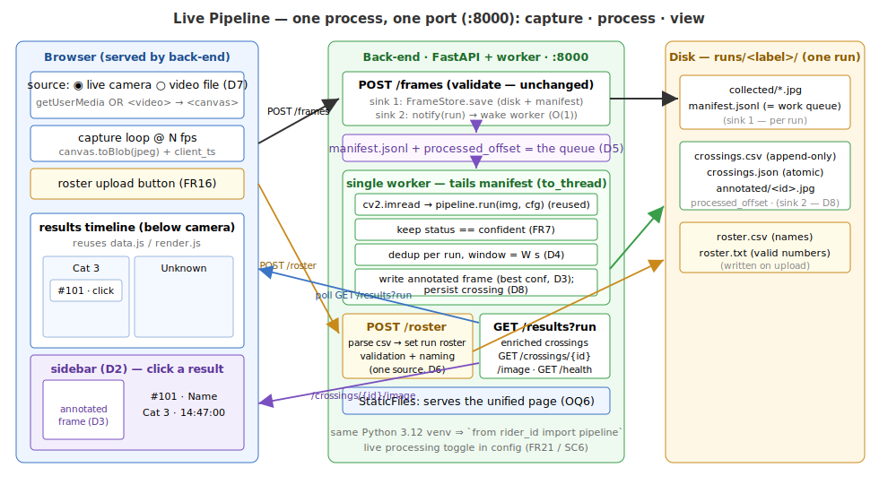

# Design — Live Pipeline: Collection → Processing → Live Results

*How* for `requirements.md`. Contracts here are **frozen** for the parallel task split; a
task that finds a signature genuinely wrong must stop and flag it (CLAUDE.md).

This feature **connects three existing pieces** — the collection back-end (`collection/`),
the CV pipeline (`src/rider_id/`), and the results viewer (`web/`) — into one page where
collected frames are processed asynchronously and their recognized numbers appear live,
each openable to the frame it came from. The guiding rule (NFR1) is **reuse, not rewrite**:
`pipeline.run`, `FrameStore`, and the viewer's `data.js`/`render.js` are used as-is; new
code is the glue.

---

## 1. Decisions resolving open questions

| Ref | Decision | Rationale |
|-----|----------|-----------|
| §5 | **A run = one capture label.** All inputs and outputs for a label live under `runs/<safe_label>/` — `collected/`, `manifest.jsonl`, `annotated/`, `roster.csv`/`roster.txt`, `crossings.csv`/`crossings.json`. Each run is self-contained: its own roster, timeline, and images; runs are isolated. | Co-locates everything for one capture, makes a run portable/deletable as a unit, and gives every crossing a back-pointer to its source frames (traceability). **Supersedes** the earlier single-session-roster framing (requirements D6/A3). |
| OQ6 | **One process, one port.** The FastAPI back-end (:8000) also **serves the unified static page** (`StaticFiles`) and the annotated images. No second static server, no CORS, one origin. | Simplest consolidation (requirements §7.1); `getUserMedia` still works because `localhost` is a secure context. `run.sh` collapses to one process. |
| OQ4 | **Video ingest is a front-end concern.** A supplied video file plays into a `<video>` element drawn to the same `<canvas>` and POSTed via the unchanged `/frames` path. The back-end never learns about video. | Reuses the entire capture/transport/pipeline path; the only new logic is choosing the pixel source and deriving `client_ts` from video time (D7). |
| D5 | **The manifest *is* the queue.** The `/frames` handler stores the frame (sink 1, unchanged) then just **wakes the worker**; the single worker **tails each run's `manifest.jsonl` from a persisted `processed_offset`**, running `pipeline.run` in a thread per line. No in-memory queue holds work state. | The manifest is already the durable, append-only, in-order record of every accepted frame; tailing it from an offset gives **in-order, exactly-once, restart-anytime** processing for free (FR6, NFR3) — nothing exists only in memory, so nothing can be dropped, and live operation and restart recovery are the *same* loop (idempotent: re-running from any offset converges to the same crossings). `to_thread` keeps the event loop free during CPU-bound inference (NFR2). |
| §4 | **Run ids are normalized server-side.** `/roster` and `/results` accept the operator's **raw label**; the back-end applies `FrameStore.safe_label` and echoes the safe id in every response (`POST /frames` 201 additionally gains a `run` field). | The label→id sanitizer lives in exactly one place (Python). UX components sync on the label the operator typed; the front-end never re-implements the transform. |
| A3 | **The roster does not gate crossings.** `validate` gains an `accept_unmatched` mode: a confident read absent from the run's roster is **kept** (unsnappable reads pass through as-is) and surfaces as an **unknown rider** (`matched: false`); the roster still powers edit-distance snapping and name/category enrichment. | Matches requirements A3/FR20 — an unregistered or mis-rostered rider is visible in the timeline instead of silently rejected by the pipeline. |
| D4 | **Time-window dedup keyed by `(run, number)`.** Within a run, confident reads of the same number within `dedup_window_s` collapse into one crossing; a gap beyond the window starts a new crossing (later lap). Runs are isolated — the same number in two runs is always two crossings. | Matches the viewer's crossing model without a full multi-object tracker (out of scope §7.2). |
| OQ2 | **Crossing time = first confident read; image = highest-confidence frame.** The row appears the instant a number is first read (liveness); its annotated image may improve while the crossing stays open. | "When did they cross" is best proxied by first sighting; the clearest *picture* is the most confident read. |
| D6 | **Back-end owns one roster per run.** `POST /roster` (with a `run`) sets that run's valid-number set **and** name/category map; `GET /results?run=…` returns that run's crossings **already enriched**. | Single source per run; the front-end never needs its own roster, killing the two-roster drift. |
| OQ8 | **Roster applies going forward.** A new upload rewrites *that run's* roster files; only frames of that run processed afterward see it. Existing crossings are untouched. | Confirmed; avoids retroactive rewrites of produced results. |
| OQ5 | **Poll `GET /results?run=…`** for the active run on an interval (reuses the viewer's `refresh()` loop). | Already-proven model; push (SSE) stays a later swap behind the same entry point. |

All are single config values (§7) — defaults, not debt.

---

## 2. Tech stack (additions only)

Everything the collection app and viewer already use, **plus**:

| Concern | Choice | Why |
|---|---|---|
| Async processing | **Manifest tail + `asyncio.Event` + one background task** started on FastAPI startup | In-process, no broker; the per-run `manifest.jsonl` + `processed_offset` is the durable work queue, so ordering, exactly-once, and restart recovery come for free (D5). |
| CPU-bound inference off the event loop | **`asyncio.to_thread(pipeline.run, …)`** | `pipeline.run` (YOLO+OCR) is blocking; a thread keeps `/frames` responsive (NFR2). One worker ⇒ still serial. |
| Frame decode / annotate | **`cv2` + `rider_id.io_out`** (already in the venv) | `cv2.imread` the stored JPEG → the exact `image_bgr` the pipeline takes; `write_annotated_image` reused verbatim for the sidebar image (D3). |
| Serving the page | **`fastapi.staticfiles.StaticFiles`** | One origin, no CORS, one port (OQ6). |
| Results view | **the viewer's `data.js` / `render.js` / `csv.js`**, adapted copies | Reuse the timeline (NFR1); render gains clickable cards + a sidebar. |
| Video source | **`<video>` + object URL + `<canvas>`** (browser-native) | No new dependency; same canvas→JPEG path as the camera (D7). |

No new Python packages beyond what `collection/` and `rider_id/` already require.

---

## 3. Architecture



One process on :8000. The browser (served by that process) captures frames from the
**camera or a video file** and POSTs them unchanged. The `/frames` handler keeps its
existing **sink 1** (store frame + manifest **under the frame's run**, `runs/<safe_label>/`)
and adds **sink 2**: mark the run dirty and **wake the single worker**, which **tails that
run's `manifest.jsonl` from its persisted `processed_offset`** — per line it decodes the
stored frame, runs `pipeline.run` (snapping against that run's roster), keeps confident
reads, **dedups** them within the run into crossings, writes each crossing's **annotated
frame**, **persists** the crossing under the same run directory, then advances the offset.
Because the manifest+offset is the only work state, processing can be stopped and restarted
at any point and simply resumes — the pipeline is idempotent over the manifest. The browser
**polls `GET /results?run=<active>`** for the live timeline and loads
`GET /crossings/{id}/image` into the **sidebar** on click. `POST /roster` (with the run's
label) sets that run's roster used for both snapping and naming.

### 3.1 Files (exclusive ownership for the task split)

New / changed, grouped by side. The collection back-end's own contracts are **editable in
this spec** (freezing only holds within a spec's parallel task fan-out); we change
`create_app`/`__main__` directly where the integration needs it.

| File | Owns | Status |
|------|------|--------|
| `collection/backend/live_config.py` | `LiveConfig` dataclass + `load_live_config(path)`. | new |
| `collection/backend/results_models.py` | `Crossing` dataclass (serialisable) + internal open-crossing state. | new |
| `collection/backend/engine.py` | `ResultsEngine`: manifest tailer, worker, dedup, per-run roster, per-run crossing store, annotated frames. | new |
| `collection/backend/storage.py` | write frames + manifest **per run** under `runs/<safe_label>/collected/` + `runs/<safe_label>/manifest.jsonl` (was one global `collected/` tree). **Includes updating `collection/backend/tests/test_frames.py`**, which asserts the old global-manifest layout (lines 167/200/368/409). | changed |
| `collection/backend/app.py` | extend `create_app(cfg, live=None)`; add `/runs`, `/results`, `/roster`, `/crossings/{id}/image`, static mount, startup/shutdown, `notify` after store. `live` defaults to `None` so pure-collection use keeps working. | changed |
| `src/rider_id/io_out.py` | `write_annotated_image(…, filename="annotated.jpg")` — new optional output-name parameter (default preserves POC behaviour); needed because the engine writes `annotated/<crossing_id>.jpg`. | changed |
| `src/rider_id/validate.py` + `tests/test_validate.py` | `accept_unmatched` mode: when `cfg["validate"]["accept_unmatched"]` is true, a best candidate with no roster match within the edit budget is **accepted as-is** instead of rejected (snapping unchanged). Default `false` preserves POC behaviour. | changed |
| `collection/backend/__main__.py` | also load live config and pass it to `create_app`. | changed |
| `collection/backend/config.yaml` | add `live:` section (§7). | changed |
| `collection/frontend/index.html` | add source selector, roster upload, `<main id="timeline">`, `<aside id="sidebar">` below the camera. | changed |
| `collection/frontend/config.js` | add results-poll + source keys. | changed |
| `collection/frontend/app.js` | keep capture; add source switching, video, roster upload. | changed |
| `collection/frontend/results/data.js` | adapted copy of `web/data.js` (transforms; `Result` gains `crossingId`, `annotatedUrl`). | new |
| `collection/frontend/results/render.js` | adapted copy of `web/render.js` — cards carry `data-crossing-id` and are clickable. | new |
| `collection/frontend/results/results.js` | poll `/results?run=<active>` → transforms → `renderTimeline`; wire card click → sidebar; track the active run. | new |
| `collection/frontend/results/sidebar.js` | open/replace/close the sidebar; show annotated frame + details. | new |
| `collection/frontend/styles.css` | layout (camera top / timeline below), sidebar, cards. | changed |
| `collection/run.sh` | collapse to the single back-end process (serves the page). | changed |

> **Consolidation — `web/` is absorbed, then deleted.** `results/data.js`, `render.js`, and
> `csv.js` start as **copies** of the viewer's modules (the static server is rooted at
> `collection/frontend/`, so a cross-directory import is awkward), adapted for enrichment +
> clickable cards. Once the unified page renders live results end-to-end, the standalone
> `web/` tree is **removed** — this spec fully supersedes the `results-ux` viewer, folding it
> into the collection app. There is no second viewer to keep in sync afterward.

---

## 4. FROZEN CONTRACT — HTTP API (additions)

Existing `GET /health` and `POST /frames` (collection design §4) are **unchanged** —
`POST /frames` behaves identically and additionally wakes the processing worker. One
additive change: the 201 body gains `"run": "<safe_label>"` so the front-end learns the
run id without re-implementing the sanitizer. Same-origin now, so CORS is a no-op but
stays configured.

**Run-id normalization (all routes below):** wherever a `run` parameter appears, the
back-end accepts the operator's **raw label** and normalizes it with
`FrameStore.safe_label` (the same transform sink 1 uses); every response echoes the
**safe id**. Passing an already-safe id is naturally a no-op.

### `GET /runs`
List known run ids so the page can populate a run selector (a run appears once its label
has been captured under or a roster uploaded to it).
- **200** → `{"runs": ["lap3-nearside", "lap4-nearside"]}` (safe-label ids; order unspecified).

### `GET /results?run=<label>`
Current crossings **for one run** (FR2, FR8). `run` is the operator's label (normalized
server-side; the response echoes the safe id).
- **200** →
  ```json
  {"run": "lap3-nearside",
   "crossings": [
    {"crossing_id": "lap3-nearside-101-1752600420000",
     "run": "lap3-nearside",
     "number": "101",
     "time": "2026-07-11T14:47:00.482-07:00",
     "confidence": 0.997,
     "name": "George Watkins",
     "category": "Cat 3",
     "matched": true,
     "annotated_url": "/crossings/lap3-nearside-101-1752600420000/image"}
  ]}
  ```
  `name` is `null` and `matched` is `false` for a recognised number absent from that run's
  roster (viewer's "unknown rider" treatment — such reads become crossings because
  `accept_unmatched` is on, §1/A3). Order is unspecified; the front-end sorts.
- **200** with `"crossings": []` for an unknown/empty run (not a 404 — the timeline for a
  run that has produced nothing yet is simply empty).

### `POST /roster`
Set **one run's** roster, used for validation **and** naming (FR16–FR19, D6).
- **Request:** `multipart/form-data`, field `run` = the target run's **label** (raw;
  normalized server-side — usually posted *before* any frame, which is fine: the run
  directory is created on first touch), field `roster` = a `text/csv` file, rows
  `race_number,name,category` (header row tolerated and skipped; quoted fields allowed).
- **200** → `{"status": "ok", "run": "lap3-nearside", "count": 42}` (rows accepted). Rewrites
  that run's `roster.csv` (names) and `roster.txt` (valid numbers) atomically; applies to that
  run's frames processed **after** this call (OQ8).
- **400** → `{"status": "error", "detail": "<msg>"}` for an unparseable/empty roster or a
  missing/invalid `run`; the run's **previous roster stays active** (FR19).

### `GET /crossings/{crossing_id}/image`
The crossing's annotated representative frame for the sidebar (FR13, FR15, D3). The
`crossing_id` encodes its run (§5), so this route stays flat — no `run` query needed.
- **200** → `image/jpeg` (box + number drawn on the full frame).
- **404** → unknown `crossing_id`.

### `GET /` and assets
`StaticFiles` serves `collection/frontend/` (OQ6). `GET /health` and the API routes take
precedence over the static mount.

---

## 5. FROZEN CONTRACT — On-disk layout (additions)

Everything for a capture is namespaced under its run. The storage root (`storage.dir`) is
renamed `runs/`; **each run is one `<safe_label>/` directory** holding both sinks (D8, FR8a):

```
runs/                             # storage.dir (was collected/)
  <safe_label>/                   # ONE RUN — all inputs + outputs for this capture label
    collected/*.jpg               # sink 1 — this run's input frames
    manifest.jsonl                # sink 1 — append-only, this run's frames only; ALSO the work queue
    processed_offset              # sink 2 — one integer: manifest lines fully processed
    crossings.csv                 # sink 2 — append-only: one "time,race_number" row per crossing
    crossings.json                # sink 2 — full crossing objects, atomically rewritten on change
    annotated/
      <crossing_id>.jpg           # sink 2 — annotated representative frame (overwritten if bettered)
    roster.csv                    # this run's names, written by POST /roster
    roster.txt                    # this run's valid numbers (this run's validate.roster)
```

- **Sink 1 layout changes with this spec.** Frames move from `collected/<safe_label>/*.jpg`
  to `runs/<safe_label>/collected/*.jpg`, and the manifest becomes **per-run** rather than one
  global file. The collection back-end's storage contracts are editable within this spec
  (§3.1), so `FrameStore` is adjusted to write under the run directory; `safe_label` is reused
  verbatim to derive the run id. Existing `collected/` data from before this spec is **not
  migrated** — old captures simply don't appear as runs.
- **`manifest.jsonl` doubles as the work queue (D5).** Each line already carries everything
  the worker needs (`filename`, `client_ts`, `safe_label`); the worker processes lines
  strictly in file order.
- **`processed_offset`** is a text file holding one integer: the count of manifest lines
  the worker is **done with** — folded + persisted, or failed + logged-and-skipped (poison
  frames advance it too; see the worker loop, §6). It is rewritten atomically (temp +
  `os.replace`) after each frame. A crash between fold and offset write means one frame is
  re-processed on resume — `_fold` is idempotent for a replay (same `crossing_id`, same
  outcome), except a possible duplicate `crossings.csv` line, which that file's consumers
  (export/audit) tolerate.
- **`crossings.csv`** is the append-only durable log (restart-safe, human-readable, portable
  export/audit — the append-safe form FR8a calls for): one `time,race_number` row is written
  when the crossing first opens. `GET /results` and restart recovery use `crossings.json`;
  the CSV is the simple, append-only record beside it.
- **`crossings.json`** is the authoritative rich state (annotated path, best confidence,
  enrichment, **and each crossing's `last_seen`**, so dedup state survives a restart);
  rewritten via temp-file + atomic `os.replace` so `GET /results` / a reader never sees a
  partial file.
- **`crossing_id`** = `f"{safe_label}-{number}-{first_seen_epoch_ms}"` — **encodes the run**,
  stays globally unique, and is the path component for the annotated image (so the flat
  `GET /crossings/{id}/image` route resolves without a `run` param). The encoding is for
  uniqueness and debuggability only — it is **not parseable** (`safe_label` itself can
  contain hyphens, e.g. `lap3-nearside`); lookups go through the engine's in-memory
  id→crossing index, never by string-splitting the id.
- **`annotated/<crossing_id>.jpg`** flattens the old `crossings/<id>/annotated.jpg` — one
  image per crossing, named by the (run-encoding) id.

On startup the engine scans `runs/*/`, loads each run's `crossings.json` (so produced
crossings survive a restart, D8) **and rebuilds its open-crossing dedup state from the
persisted `last_seen`/`confidence` values**, then resumes each run's manifest tail from its
`processed_offset`. Startup is therefore just the normal loop with nothing new appended —
no special recovery path.

---

## 6. FROZEN CONTRACT — Back-end modules & signatures

New dataclasses (`results_models.py`):
```python
@dataclass
class Crossing:
    crossing_id: str        # f"{run}-{number}-{first_seen_epoch_ms}"
    run: str                # safe-label run id this crossing belongs to
    number: str             # validated race number
    time: str               # ISO-8601 — client_ts of the first confident read (OQ2)
    confidence: float       # best confidence among the reads folded in so far
    name: str | None        # roster name, or None when unmatched
    category: str           # roster category, or "Unknown"
    matched: bool           # roster had this number
    annotated_path: str     # relative to storage root, e.g. "<run>/annotated/<id>.jpg"
    last_seen: str          # ISO-8601 — newest read folded in; persisted so dedup state
                            # survives a restart (harmless extra field in GET /results)
```

Live config (`live_config.py`):
```python
@dataclass
class LiveConfig:
    enabled: bool
    cv_config_path: str      # repo POC config.yaml (detector/zone/ocr/validate/score)
    dedup_window_s: float
    statuses: tuple[str, ...]  # which pipeline statuses become crossings, e.g. ("confident",)

def load_live_config(path: str) -> LiveConfig | None:
    """Parse the `live:` section of the back-end config.yaml. None ⇒ processing disabled."""
```

(The storage root is *not* duplicated here — the engine receives it from
`AppConfig.storage_dir` at `create_app` time, so the two can't drift.)

Engine (`engine.py`) — signatures frozen; bodies per task:
```python
class ResultsEngine:
    def __init__(self, live: LiveConfig, cv_cfg: dict, run_root: str) -> None: ...
        # cv_cfg = rider_id.config.load_config(live.cv_config_path)
        # run_root = AppConfig.storage_dir (holds runs/<safe_label>/)

    async def start(self) -> None: ...
        # scan runs/*/: load crossings.json (rebuild dedup state from last_seen),
        # mark every run with unprocessed manifest lines dirty; launch the worker task

    async def stop(self) -> None: ...
        # signal + await the worker; flush state

    def notify(self, run: str) -> None: ...
        # mark `run` dirty + set the wake event; called by /frames after store.save.
        # Carries no work state — the manifest is the queue, so this can never lose a frame.

    def runs(self) -> list[str]: ...
        # known run ids (safe labels) for GET /runs

    def set_roster(self, label: str, csv_text: str) -> tuple[str, int]: ...
        # normalize label → run id; parse number,name,category; replace THIS RUN's active
        # roster; atomically write runs/<run>/roster.csv + roster.txt (creating the run dir
        # if needed — roster usually lands before the first frame); return (run_id, count).
        # Raises ValueError on bad input.

    def crossings(self, label: str) -> tuple[str, list[Crossing]]: ...
        # normalize label → run id; copied snapshot of that run's crossings for
        # GET /results ([] if unknown)

    def annotated_path(self, crossing_id: str) -> str | None: ...
        # absolute path to the crossing's annotated jpg, or None. Resolved via the
        # in-memory id→crossing index — NEVER by splitting the id (safe labels may
        # contain hyphens, so the id is not unambiguously parseable, §5)

    # --- internal (run in the worker thread) ---
    def _process_frame(self, run: str, entry: dict) -> None: ...
        # entry = one parsed manifest line (filename, client_ts, …);
        # point cv_cfg["validate"]["roster"] at runs/<run>/roster.txt;
        # cv2.imread(run_root/<run>/collected/…) → pipeline.run(img, cv_cfg)
        # → keep cfg.statuses → _fold(run, number, conf, client_ts, img, frame_results) per read
    def _fold(self, run, number, conf, client_ts, image_bgr, frame_results) -> None: ...
        # dedup within `run` + open/update crossing + annotate + persist (algorithm §6.1)
```

The worker loop (in `start`) is, in essence:
```python
while running:
    await self._wake.wait(); self._wake.clear()
    for run in self._drain_dirty():                       # set of dirty run ids
        offset = read_offset(run)
        for entry in manifest_lines(run)[offset:]:        # strictly in file order
            try:
                await asyncio.to_thread(self._process_frame, run, entry)
            except Exception:
                log.exception("frame failed, skipping", run, entry)   # FR6: never stall
            offset += 1
            write_offset_atomic(run, offset)              # advances past poison frames too
```

The `try/except` is part of the frozen contract: a frame that fails **deterministically**
(corrupt JPEG, OCR edge case, truncated write) is logged and the offset advances past it —
otherwise every wake would retry the same line and the run would stop making progress,
violating FR6 ("a frame that fails to process is logged and the loop continues"). The
offset therefore means "lines the worker is *done with*" (processed or skipped-with-log),
not "lines that produced results".

**Concurrency conventions (frozen with the signatures).** `_process_frame`/`_fold` run in
the worker thread; the HTTP handlers run on the event loop. Shared state follows two rules:
(1) **replace, don't mutate** — a roster upload builds a *new* immutable map/set and rebinds
the reference the worker reads; (2) **snapshot on read** — `crossings()` returns a copy, and
`GET /results` never sees a list mid-mutation. `cv_cfg` is only ever written by the single
worker.

### 6.1 Dedup algorithm (`_fold`)

State: `self._open: dict[tuple[str, str], _OpenCrossing]` keyed by `(run, number)`, where
`_OpenCrossing` holds `crossing_id, first_seen, last_seen, best_conf`. Keying by `(run,
number)` isolates runs (D4): the same number under two labels never collapses.

For a confident read `(run r, number n, conf c, time t, frame img, frame_results R)`, all
writes land under that run's directory `runs/<r>/`:

1. `oc = self._open.get((r, n))`
2. **New crossing** if `oc is None` **or** `(t − oc.last_seen) > dedup_window_s`:
   - `cid = f"{r}-{n}-{epoch_ms(t)}"`; enrich `(name, category)` from **run `r`'s** active
     roster and set `matched = n in <run r's roster number set>`. `validate` returns only
     `(number, raw_text, conf)` — a snapped read and an `accept_unmatched` pass-through are
     indistinguishable from the return value, but the membership test separates them: a snap
     lands the number *in* the roster, an unmatched-accept doesn't. The engine keeps each
     run's roster number set in memory for this.
   - Write `runs/<r>/annotated/<cid>.jpg` via
     `io_out.write_annotated_image(img, R, zone, annotated_dir, filename=f"{cid}.jpg")`
     (the new optional `filename` parameter, §3.1 — the POC default stays `annotated.jpg`).
   - Append a `t,n` row to `runs/<r>/crossings.csv`; add the `Crossing` (with `run=r`) to memory;
     atomically rewrite `runs/<r>/crossings.json`.
   - `self._open[(r, n)] = _OpenCrossing(cid, first_seen=t, last_seen=t, best_conf=c)`.
   - Replaying the same manifest line (crash before the offset write) recomputes the same
     `cid` and converges to the same state — idempotent.
3. **Same crossing** otherwise (within window):
   - `oc.last_seen = max(oc.last_seen, t)` — the browser keeps a few POSTs in flight
     (`MAX_IN_FLIGHT` in the collection front-end's `config.js`), so manifest order can
     trail `client_ts` order by a frame or two; `max` keeps the window from regressing.
     Same caveat for the crossing's representative `time`: it is the `client_ts` of the
     **first worker-processed** confident read, not `min(client_ts)` over the fold — off by
     at most that same frame or two, which is acceptable (OQ2).
   - If `c > oc.best_conf`: `oc.best_conf = c`; re-render the annotated frame from this
     better `img`; update the `Crossing`'s `confidence` + keep `annotated_path`; atomically
     rewrite that run's `crossings.json`. Representative `time` stays the first-seen value (OQ2).

`zone` is resolved per frame from `cv_cfg` (`zones.load_zone` + `resolve_zone`, as
`run_poc.py` does) — cheap and handles varying frame heights (camera vs. video).

> **Note on `pipeline.run` + per-run roster.** `pipeline.run` internally calls
> `validate.load_roster(cv_cfg)`, which reads `cv_cfg["validate"]["roster"]` from disk each
> frame. Because the roster is now **per run**, `_process_frame` sets
> `cv_cfg["validate"]["roster"] = runs/<run>/roster.txt` for the frame's run **before** calling
> `pipeline.run` (safe — the single worker is the only writer of `cv_cfg`). Each
> `set_roster(label, …)` writes that run's file atomically, so validation picks up a new roster on
> that run's **next** frame — exactly the "apply going forward" semantics (OQ8). The small
> per-frame read is negligible beside inference.
>
> **Note on roster semantics (`accept_unmatched`, §1/A3).** The POC's `validate.validate`
> **rejects** any read that isn't an exact roster match or a unique edit-distance-1 snap —
> with a roster active, an unregistered rider could never appear at all. This spec adds
> `cfg["validate"]["accept_unmatched"]` (default `false` = POC behaviour): when `true`, step
> 4c of the algorithm returns the best candidate **as-is** instead of rejecting. Snapping is
> unchanged, so an OCR near-miss (e.g. `104` with `101` rostered and nothing else within
> distance 1) still snaps — the flag only rescues reads with *no* snap target. The engine's
> cv config sets it `true`; the crossing's `matched` flag records whether the run's roster
> knew the number, computed by the engine as roster-set membership (§6.1 step 2), since
> `validate`'s return value alone can't distinguish a snap from a pass-through.

---

## 7. Configuration

Back-end `config.yaml` gains a `live:` section (absent/`enabled: false` ⇒ pure collection,
SC6). Existing sections unchanged.

```yaml
storage:
  dir: runs/                          # renamed from collected/ — holds runs/<safe_label>/ dirs
  # manifest_name: manifest.jsonl     # now written per run under runs/<safe_label>/
live:
  enabled: true
  cv_config: ../../config.yaml        # repo POC pipeline config
  dedup_window_s: 5.0                 # FR9/FR11 — collapse repeats of a number within 5 s
  statuses: [confident]               # FR7 — only confident reads become crossings
```

Per-run file names (`collected/`, `manifest.jsonl`, `roster.csv`, `roster.txt`,
`crossings.csv`, `crossings.json`, `annotated/`) are fixed conventions under
`storage.dir/<safe_label>/` (§5), not separate config paths — the engine receives that one
root from `AppConfig.storage_dir` (§6). `cv_config`'s own `validate.roster` becomes a
**default only**; the engine overrides it per-run at process time (§6.1). The repo POC
`config.yaml` gains `validate.accept_unmatched: true` for the live pipeline's roster
semantics (§6.1 note; the key defaults to `false`, preserving batch-POC behaviour where
unset).

Front-end `config.js` (additive keys):
```js
window.COLLECTION_CONFIG = {
  // …existing keys…
  BACKEND_URL:  "",          // same-origin now (served by the back-end)
  RESULTS_POLL_MS: 1500,     // GET /results cadence (OQ5)
  DEFAULT_SOURCE: "camera",  // "camera" | "video" (D7)
};
```

---

## 8. Front-end structure

One page, camera on top, timeline below, sidebar to the side (D1/D2). The capture loop
(`app.js`) is unchanged in spirit; it gains a **pixel-source abstraction** and two new
controls.

- **Source selector (D7).** `camera` ⇒ today's `getUserMedia` stream in `<video id="preview">`.
  `video` ⇒ an `<input type="file" accept="video/*">` sets `preview.src` to an object URL;
  **Start** plays it and runs the same capture timer. `captureTick` draws `preview` to the
  canvas regardless of source. For a video, `client_ts = new Date(videoStartWallclock +
  preview.currentTime*1000).toISOString()` so crossings spread across the video's timeline
  (FR4a); for the camera, `client_ts` stays wall-clock now.
- **Roster upload (FR16).** A file input + button POST the CSV **plus the label currently
  in the label field** (raw — the back-end normalizes, §4) to `/roster`; the status line
  shows the accepted count or the rejection message (FR19). Uploading **before** the first
  frame is the normal flow — the back-end creates the run directory on first touch.
- **Results timeline (FR2/FR3).** All UX components sync on the **label field**: it is the
  active run. `results.js` polls `GET /results?run=<label>` every `RESULTS_POLL_MS` (raw
  label; the back-end normalizes and echoes the safe id), builds `Result[]` (already
  enriched — skip `mergeResults`), then `sortDescending → groupIntoPacks → computeLanes →
  renderTimeline` (all reused). A `GET /runs`-backed selector can set the label to a past
  run to view its results. Changing the label repoints the poll and clears the timeline
  root. Live refresh must not steal scroll or reset controls (FR4): re-render is into the
  timeline root only, and the selected card's highlight is re-applied after each render (the
  sidebar tracks `crossing_id`, which is stable across polls).
- **Sidebar (D2/D3).** `render.js` cards carry `data-crossing-id` and `data-annotated-url`.
  A delegated click handler calls `sidebar.open(crossing)`, which sets the `<aside>` content
  to the crossing's `annotated_url` `` plus number/name/category/time; a second click
  **replaces** content (no stacking); a close button hides it (FR14). Sidebar sits beside the
  timeline; below a width breakpoint it can overlay (CSS only).

---

## 9. How this extends later

- **Push instead of poll** — swap `results.js`'s poll for SSE/websocket behind the same
  render call (OQ5); the back-end already holds the authoritative crossing state in memory
  (backed by `crossings.json`).
- **`needs_review` lane** — the engine already computes non-confident reads; surfacing them
  (OQ3) is a config `statuses` addition + a distinct card style, no algorithm change.
- **Real tracking** — `_fold`'s time-window heuristic can be replaced by a multi-object
  tracker without touching the HTTP/disk contracts (§7.2).
- **Single viewer source** — after this spec the timeline lives only in
  `collection/frontend/results/` (`web/` is deleted); future viewer work has one home.
- **Throughput** — one worker tails the manifest for ordering; a bounded pool with
  per-number affinity could parallelise inference later if CPU allows, the manifest+offset
  contract staying unchanged.

---

## 10. Run / serve

One process, one port (OQ6):
```bash
source .venv/bin/activate            # Python 3.12
cd collection && python -m backend   # serves the page + API on :8000
# open http://localhost:8000
```
`collection/run.sh` collapses to this single process (drops the separate static server).
First run still pulls the YOLO/PaddleOCR models (CLAUDE.md); with `live.enabled: false` the
app is exactly today's collector (SC6).

---

## 11. Risks & mitigations

| Risk | Impact | Mitigation |
|---|---|---|
| CPU can't keep up at capture fps | processing lags capture | Accepted (D5): the worker's manifest tail drains after the burst; frames are durable on disk; capture never blocks (sink 1 first, `notify` is O(1)). |
| `pipeline.run` blocks the event loop | `/frames` stalls, tab backpressures | Run inference via `asyncio.to_thread`; single worker keeps ordering (NFR2/NFR3). |
| Crash between fold and offset write | one frame re-processed on resume | `_fold` is idempotent for a replayed manifest line (same `crossing_id`, same state); at worst one duplicate `crossings.csv` audit row (§5). |
| Poison frame (corrupt JPEG, OCR crash) fails deterministically | run stops making progress | Frozen worker loop wraps `_process_frame` in `try/except`: log + advance the offset past the bad line (FR6, §6). |
| Same rider double-counted / split | wrong crossing count | Time-window dedup keyed by number (§6.1); window is configurable (FR11). Cross-lap correctness via the `> window` branch (FR10). |
| Partial `crossings.json` read | UI shows garbage | Atomic temp-file + `os.replace`; `crossings.csv` append-only. |
| Bad roster upload | validation/naming breaks | Parse-then-swap: reject with 400 and keep the previous roster (FR19). |
| Video `client_ts` collides with live wall-clock | mixed/duplicated timeline | Video derives `client_ts` from `videoStart + currentTime`; sources are used one at a time. |
| Per-frame `cv_cfg["validate"]["roster"]` mutation | wrong run's numbers validate a frame | Only the single worker mutates `cv_cfg`, and it sets the roster path from the frame's own run before `pipeline.run` (§6.1) — serial, so no cross-run bleed. |
| `accept_unmatched` lets OCR garbage through | spurious "unknown rider" crossings | Only **confident** reads become crossings (FR7, `confidence_threshold`); digit-count/leading-zero filters still apply; snapping still corrects near-misses. Tune threshold in integration if needed. |
| No roster yet for a run | crossings appear un-named | Degrades to the "unknown rider" path (FR20): capture/store/crossings still work (confidence-only validation); uploading a roster starts enriching that run's subsequent frames. |
| Run proliferation from typo'd labels | scattered tiny runs | Runs are just directories keyed by `safe_label`; a typo makes a new run (accepted — matches operator intent to name runs), listed via `GET /runs` so the operator sees/selects them. |
| Editing `create_app`/storage regresses the shipped collector | pure-collection breakage | `live` defaults to `None` (pure collection = today's behaviour). The per-run layout **does** change `test_frames.py`'s expectations — the storage task owns updating that suite (§3.1), and it must be green before integration. |

---

## 12. Task split (preview — detailed in `tasks/`)

1. **Scaffold (blocking).** New back-end modules with frozen types/signatures
   (`live_config.py`, `results_models.py`, `engine.py` stubs), `create_app(cfg, live=None)`
   wiring + new routes returning stubs, `live:` config, `config.js` keys, and the
   `index.html`/`styles.css` shell (camera top, empty timeline below, empty sidebar). Nothing
   else starts until this lands.
2. **Parallel.**
   - **Engine** — manifest tailer + worker + per-run `_process_frame`/`_fold` dedup +
     persistence + annotated frames (`engine.py`, owns `runs/<label>/crossings.*` +
     `annotated/` + `processed_offset`). Also owns the two small `rider_id` edits it
     consumes: `io_out.write_annotated_image`'s `filename` parameter and
     `validate.accept_unmatched` (+ its `tests/test_validate.py` cases).
   - **Per-run storage** — `storage.py` writes frames + manifest under `runs/<safe_label>/`;
     **owns updating `collection/backend/tests/test_frames.py`** to the per-run layout.
   - **Roster** — `set_roster(label, …)` with server-side label normalization + `POST /roster`
     + atomic file writes; `GET /runs`.
   - **Front-end results** — `results/{data,render,results,sidebar}.js` + timeline/sidebar CSS;
     label-driven poll + run selector.
   - **Front-end capture** — source selector + video ingest + roster-upload control (posting
     the raw label) in `app.js`/`index.html`.
3. **Integration & tuning.** End-to-end (camera and a sample video), dedup window tuning
   against a real burst, a **kill-and-restart mid-burst** check (worker resumes from
   `processed_offset`, no duplicate or missing crossings), a **poison-frame** check (a
   deliberately corrupt JPEG in the manifest is logged and skipped; later frames still
   process — FR6), and the `live.enabled: false` regression (SC6). **Cleanup:** once the unified page renders live results, **delete the
   `web/` tree** (its logic now lives in `collection/frontend/results/`); update the root
   `README.md` to drop the standalone-viewer instructions.
```
