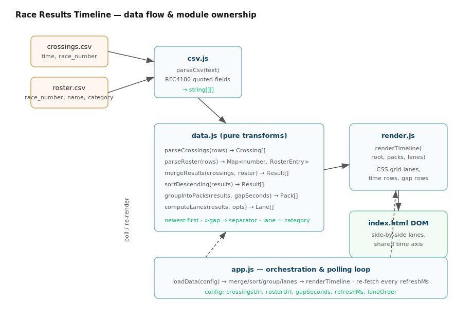

# Design — Race Results Timeline UX

*How* for the requirements in `requirements.md`. Contracts here are **frozen** for the
parallel task split; a task that finds a signature genuinely wrong must stop and flag it.

## 1. Decisions resolving open questions

| Ref | Decision | Rationale |
|-----|----------|-----------|
| OQ1 | **Poll the CSVs on an interval** (`refreshMs`, default 5000). `refreshMs: 0` renders once. No websockets. | Gives "live at the finish line" as the upstream pipeline appends rows, while staying a plain static site. Static render is just `refreshMs: 0`. |
| OQ5 | **Lanes side-by-side above a breakpoint; collapse to one interleaved column below it** (`collapseBreakpointPx`, default 640). Category shown as a chip on each card when collapsed. | Preserves the time-interspersed reading (the core value) on a phone without horizontal scroll. |
| OQ6 | **Lane order = roster category first-appearance**, override via `laneOrder`; **Unknown always last**. Soft cap ~5 lanes before collapse is advised. | Deterministic and data-driven; explicit override when organisers want a fixed order. |
| OQ3 | Lanes are header-labelled columns; **optional per-lane accent colour** derived from category, off by default. | Keeps v1 simple, leaves colour-coding trivial to switch on. |

These are defaults, not tech debt — all are single config values (§6).

## 2. Tech stack

- **Static site, no framework, no build step.** Vanilla ES modules + one CSS file. This
  is the smallest thing that meets zero-install (NFR1), offline (NFR3), and no-license
  (NFR5). No npm dependency at runtime.
- **CSV parsing hand-rolled** (`csv.js`) — the roster has quoted fields containing commas
  (`"George Watkins","Cat 3"`), so a naive `split(',')` is wrong; we implement a small
  RFC4180 reader. No PapaParse dependency.
- **Served by `python -m http.server`** from `web/` (browsers block `fetch()` over
  `file://`). Fits the project's Python/offline stance; any static host works.
- **Layout via CSS Grid** — columns = lanes, rows = time-ordered crossings; gap
  separators span all columns. Ordinal rows (one row per crossing), not pixel-proportional
  to elapsed seconds — see §7 non-goals.

## 3. Architecture



Flow: fetch both CSVs → `parseCsv` → `parseCrossings` / `parseRoster` → `mergeResults`
(join on `race_number`) → `sortDescending` → `groupIntoPacks` (gap rule) +
`computeLanes` (categories present) → `renderTimeline` into the DOM. `app.js` owns config
and the polling loop that re-runs the pipeline.

### 3.1 Files (exclusive ownership for the task split)

| File | Owns | Depends on |
|------|------|-----------|
| `web/index.html`  | Page shell, module + CSS includes, `<main id="timeline">` mount, config `<script>`. | — |
| `web/csv.js`      | `parseCsv`. | — |
| `web/data.js`     | Types + all pure transforms (parse/merge/sort/group/lanes). | `csv.js` (types only) |
| `web/render.js`   | DOM building, time formatting. | `data.js` types |
| `web/app.js`      | Config resolution, fetch, polling, wiring transforms → render. | all |
| `web/styles.css`  | Grid layout, lane columns, responsive collapse, card styling. | — |
| `web/data/*.csv`  | Sample `crossings.csv` + `roster.csv` for local dev. | — |

## 4. Data model (frozen)

JS has no dataclasses; contracts are JSDoc typedefs. Times are native `Date`.

```js
/** @typedef {Object} Crossing
 *  @property {Date}    time         parsed from ISO-8601 w/ offset
 *  @property {number}  raceNumber
 */

/** @typedef {Object} RosterEntry
 *  @property {number}  raceNumber
 *  @property {string}  name
 *  @property {string}  category     e.g. "Cat 3"
 */

/** @typedef {Object} Result        merged, display-ready crossing
 *  @property {Date}     time
 *  @property {number}   raceNumber
 *  @property {?string}  name         null when unmatched
 *  @property {string}   category     roster category, or UNKNOWN_CATEGORY
 *  @property {boolean}  matched      false ⇒ no roster row
 */

/** @typedef {Object} Pack          crossings within gapSeconds of each other
 *  @property {Date}      startTime  newest crossing time in the pack (separator label)
 *  @property {Result[]}  results    descending by time
 */

/** @typedef {Object} Lane
 *  @property {string}   category    "Cat 3" … or UNKNOWN_CATEGORY
 *  @property {number}   index       0-based column position
 */
```

`export const UNKNOWN_CATEGORY = "Unknown";`

## 5. Module contracts (frozen signatures)

### 5.1 `csv.js`
```js
/** Parse RFC4180-ish CSV. Handles quoted fields, embedded commas, CRLF.
 *  Blank lines skipped. Does NOT interpret a header row. */
export function parseCsv(text /*: string */) /*: string[][] */
```

### 5.2 `data.js`
```js
export const UNKNOWN_CATEGORY;

/** rows → Crossing[]. Skips rows with unparseable time or non-numeric number (NFR4). */
export function parseCrossings(rows /*: string[][] */) /*: Crossing[] */

/** rows → Map<raceNumber, RosterEntry>. Later duplicates win; bad rows skipped. */
export function parseRoster(rows /*: string[][] */) /*: Map<number, RosterEntry> */

/** Join crossings to roster. Unmatched ⇒ name:null, matched:false, category:UNKNOWN. */
export function mergeResults(crossings /*: Crossing[] */, roster /*: Map */) /*: Result[] */

/** Stable sort, newest first. */
export function sortDescending(results /*: Result[] */) /*: Result[] */

/** Descending results → packs. New pack whenever the gap to the previous (newer)
 *  crossing exceeds gapSeconds. Each pack's startTime = its newest result's time. */
export function groupIntoPacks(results /*: Result[] */, gapSeconds /*: number */) /*: Pack[] */

/** Distinct categories present → ordered lanes. laneOrder (array|null) sets explicit
 *  order; unlisted categories follow in first-appearance order; UNKNOWN always last. */
export function computeLanes(results /*: Result[] */, opts /*: {laneOrder?: string[]} */) /*: Lane[] */
```

### 5.3 `render.js`
```js
/** Build the timeline DOM under root (clears it first). Renders lane headers, then
 *  per pack: a full-width gap separator (formatGapLabel(pack.startTime)) followed by
 *  each result as a card placed in its lane's column (grid-column) and its own row. */
export function renderTimeline(
  root  /*: HTMLElement */,
  packs /*: Pack[] */,
  lanes /*: Lane[] */,
  opts  /*: {collapseBreakpointPx: number} */
) /*: void */

export function formatTimeOfDay(d /*: Date */) /*: string */   // "hh:mm:ss"
export function formatGapLabel(d /*: Date */) /*: string */    // "hh:mm"
```

### 5.4 `app.js`
```js
/** Merge window.RESULTS_CONFIG over DEFAULT_CONFIG over ?query overrides. */
function resolveConfig() /*: Config */

/** Fetch both CSVs (cache:'no-store'); returns raw text pair. Throws on HTTP error. */
async function loadData(config) /*: Promise<{crossingsText: string, rosterText: string}> */

/** One full pass: load → transforms → renderTimeline. Renders an error banner on failure. */
async function refresh(config) /*: Promise<void> */

/** Kick off: refresh() now, then every config.refreshMs (unless 0). */
function start() /*: void */
```

## 6. Configuration

Single source, overridable at three layers (query string > page global > default):

```js
const DEFAULT_CONFIG = {
  crossingsUrl:        "data/crossings.csv",
  rosterUrl:           "data/roster.csv",
  gapSeconds:          3,        // FR4/FR6
  refreshMs:           5000,     // OQ1; 0 = render once
  laneOrder:           null,     // OQ6; e.g. ["Cat 3","Cat 4"]
  collapseBreakpointPx: 640,     // OQ5
};
```

- **Page global:** `<script>window.RESULTS_CONFIG = { gapSeconds: 5 }</script>` in
  `index.html`.
- **Query string:** `?gap=5&refresh=0&crossings=other.csv` for quick field tweaks
  (`gap`→gapSeconds, `refresh`→refreshMs, `crossings`/`roster`→urls).

## 7. Rendering model & non-goals

- **Ordinal rows, not proportional spacing.** Vertical position reflects time *order*,
  not pixel distance ∝ elapsed seconds. Gap separators + timestamps carry the "how big
  was the gap" signal (FR4). Pixel-proportional timelines are a future enhancement.
- **Grid placement.** N lanes ⇒ `grid-template-columns: repeat(N, 1fr)`. A card sets
  `grid-column: <lane.index + 1>`; each crossing occupies its own auto row so cross-lane
  time order reads top-to-bottom (FR7). Gap rows use `grid-column: 1 / -1`.
- **Collapse.** Below `collapseBreakpointPx` a media/container query switches to a single
  column; cards render full-width in pure time order with a category chip; lane headers
  hide. Same DOM, CSS-only reflow where possible.
- **Unknown lane** (FR8) is a normal lane with `category === UNKNOWN_CATEGORY`, forced
  last, distinct styling.

## 8. Error & edge handling (NFR4)

- Malformed crossing/roster line → skipped, others render.
- Fetch/HTTP failure → non-blocking error banner; previous render stays until next poll.
- Empty crossings → empty-state message.
- Unsorted input → `sortDescending` normalises.
- Duplicate `race_number` across crossings (multiple laps, OQ2) → each is its own card.

## 9. How this extends later

- **Live updates** already covered by polling as the CV pipeline appends to
  `crossings.csv`; swap to SSE/websocket later behind the same `refresh()` entry point.
- **Richer results** (laps, elapsed, placings) = add fields to `Result` + card markup;
  transforms and lane logic unchanged.
- **Colour-coded lanes** (OQ3) = one styling switch keyed on `category`.
- **Hosting** = any static server / CDN; no server code to port.

## 10. Task split (preview — detailed in `tasks/`)

1. **Scaffold (blocking):** `web/` skeleton, `index.html`, `styles.css` shell, frozen
   `data.js` typedefs + `UNKNOWN_CATEGORY`, sample CSVs, run instructions.
2. **Parallel:** `csv.js` (+ its transforms in `data.js`), `render.js`, `styles.css`
   lane/responsive layout — each against these frozen contracts.
3. **Integration:** `app.js` wiring, config layering, polling, error banner, end-to-end
   check against the sample CSVs and the §7 UX from `requirements.md`.
