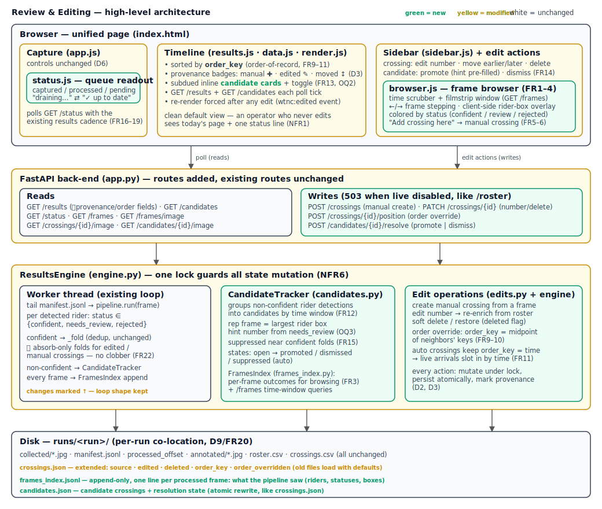

# Design — Review & Editing: Frames, Manual Crossings, Order, Queue Status

Implements `requirements.md` (this spec). *How* only — the *what & why* lives there.

## 1. Overview

No new services, no new stack: the FastAPI back-end grows read/write endpoints, the
`ResultsEngine` grows two new collaborators (a **CandidateTracker** and a
**FramesIndex**) plus edit operations, and the vanilla-JS front-end grows three new
modules (status readout, frame browser, edit actions) beside the existing timeline.
Everything remains per-run on disk, polling-based, localhost-only.

The load-bearing insight (requirements A2): `pipeline.run` already returns one
`CrossingResult` per detected rider — including `needs_review` and `rejected` — with
the rider box. Today the worker discards non-confident results. This design **retains**
them (FramesIndex, one JSONL line per processed frame) and **groups** them
(CandidateTracker) — no CV changes, no re-processing (D5).



## 2. On-disk layout (per run — additions only)

```
runs/<run>/
  crossings.json        # EXTENDED schema (§3.1) — atomic rewrite, as today
  frames_index.jsonl    # NEW  append-only; one line per *processed* frame (§3.3)
  candidates.json       # NEW  candidate list + states — atomic rewrite (§3.2)
  ...                   # everything else unchanged
```

Back-compat: old `crossings.json` files lack the new fields; the loader fills defaults
(§3.1). `frames_index.jsonl`/`candidates.json` simply don't exist for old runs —
browsing still works (manifest + raw frames), candidates are empty (OQ4: going-forward
only).

## 3. Data model (`collection/backend/results_models.py` — extended)

Contracts below are **frozen for this spec's implementation run**.

### 3.1 `Crossing` — extended (defaults keep old JSON loadable)

```python
@dataclass
class Crossing:
    crossing_id: str
    run: str
    number: str             # "" ⇒ unidentified (manual/promoted without a number)
    time: str               # ISO-8601 capture time — NEVER edited (FR10)
    confidence: float       # 0.0 for manual crossings
    name: str | None
    category: str
    matched: bool
    annotated_path: str
    last_seen: str
    # ── new (this spec) ──
    source: str = "auto"            # "auto" | "manual"   (manual incl. promoted candidates)
    edited: bool = False            # an operator changed number/rider after creation
    deleted: bool = False           # soft delete — excluded from /results, kept on disk
    order_key: float = 0.0          # order-of-record sort key; 0.0 ⇒ derive from time on load
    order_overridden: bool = False  # operator moved this crossing (badge, D3)
```

Loader rule (in `_load_crossings_json`): after `Crossing(**item)` (defaults absorb
missing keys), if `order_key == 0.0` set `order_key = float(_epoch_ms(time))`.
New auto crossings are created with `order_key = float(_epoch_ms(t))` — so **live
arrivals slot into the order by time automatically** (FR11) and never disturb overrides.

### 3.2 `Candidate` — new

```python
@dataclass
class Candidate:
    candidate_id: str          # f"{run}-cand-{first_seen_epoch_ms}"
    run: str
    time: str                  # ISO-8601 first_seen — its timeline position
    last_seen: str             # newest non-confident detection folded in
    frame_count: int           # detections folded into this candidate
    hint_number: str | None    # most-frequent needs_review number in the span (OQ3)
    hint_conf: float           # best needs_review confidence, else 0.0
    rep_filename: str          # root-relative path of representative frame
    rep_box: list[float]       # [x1,y1,x2,y2] rider box on rep frame (client overlay)
    state: str                 # "open" | "promoted" | "dismissed" | "suppressed"
    promoted_crossing_id: str | None = None
```

`candidates.json` = atomic full rewrite of the run's `list[Candidate]` (same
temp+`os.replace` pattern as `crossings.json`).

### 3.3 `frames_index.jsonl` — one line per processed frame (no dataclass; dict shape)

```json
{"filename": "<run>/collected/x.jpg", "client_ts": "...", "seq": 12,
 "riders": [{"box": [x1,y1,x2,y2], "det_conf": 0.91, "status": "rejected",
             "number": null, "raw_text": "1?8", "confidence": 0.31}]}
```

Written by the worker after every `pipeline.run` call — **including `riders: []`** so
the browser can distinguish "nothing there" from "rider there, unreadable" (FR3).
Append-only, crash-tolerant like the manifest (malformed lines skipped on read).

## 4. Back-end modules

### 4.1 `frames_index.py` — NEW (exclusive owner)

```python
class FramesIndex:
    def __init__(self, run_root: str) -> None: ...
    def append(self, run: str, entry: dict, results: list) -> None
        # entry = manifest line; results = list[CrossingResult]. Appends §3.3 line.
    def frames(self, run: str, center_ts: str | None, span_s: float, limit: int) -> list[dict]
        # Merge manifest.jsonl (all frames) + frames_index.jsonl (outcomes) into
        # [{filename, client_ts, seq, processed: bool, riders: [...]|None}]
        # within [center−span, center+span], time-ordered, capped at `limit`
        # (center None ⇒ newest `limit` frames). Reads files on demand — browse
        # is interactive-only, never on the poll hot path (NFR2).
    def meta(self, run: str) -> dict
        # {"count": int, "first_ts": str|None, "last_ts": str|None} for the scrubber.
```

### 4.2 `candidates.py` — NEW (exclusive owner)

```python
class CandidateTracker:
    def __init__(self, run_root: str, window_s: float, min_det_conf: float,
                 statuses: tuple[str, ...]) -> None: ...
    def load_existing(self) -> None            # scan runs/*/candidates.json on start
    def observe(self, run: str, ts: str, filename: str,
                results: list, had_confident: bool) -> None
        # Worker thread. Folds each result with status ∈ self.statuses and
        # det_conf ≥ min_det_conf into the run's single open candidate:
        #   • had_confident=True (frame also produced a confident fold) ⇒ ignore
        #     the frame entirely (FR15 — same rider, number read on another box).
        #   • ts − open.last_seen ≤ window_s ⇒ fold (bump last_seen/frame_count,
        #     adopt frame as rep if its rider box area is the largest so far,
        #     update hint from needs_review numbers); else leave the old
        #     candidate open for the operator and start a new one.
        # Persists candidates.json on every mutation (one small atomic rewrite
        # per folded frame — accepted at A5 volume).
    def suppress_around(self, run: str, ts: str) -> None
        # Called on EVERY confident fold — new crossing, same-crossing update,
        # or absorb-only (§4.4/§7): any OPEN candidate whose [time, last_seen]
        # span overlaps ts ± window_s → state="suppressed" (retroactive half of
        # FR15). New-crossing-only would leak candidates opened *between* two
        # folds of the same crossing (rider readable in frames 1 and 3, not 2).
        # Promoted/dismissed states never change.
    def list(self, run: str) -> list[Candidate]
    def get(self, candidate_id: str) -> Candidate | None
    def set_state(self, candidate_id: str, state: str,
                  promoted_crossing_id: str | None = None) -> Candidate
        # "promoted"/"dismissed" only; raises ValueError on unknown id/bad state.
```

Known heuristic limit (accepted, documented): two simultaneously unreadable riders
merge into one candidate — the operator sees both in the frame browser and can add
the second manually (SC3 covers it).

### 4.3 `edits.py` — NEW (pure helpers, exclusive owner)

```python
def midpoint_key(earlier_key: float | None, later_key: float | None) -> float
    # Between two neighbors: (earlier+later)/2.
    # Top of order (no earlier):  later − 60_000.
    # Bottom (no later):          earlier + 60_000.
    # earlier_key < later_key required; raises ValueError otherwise.

def enrich(number: str, roster) -> tuple[str | None, str, bool]
    # (name, category, matched) from a RunRosters roster — the same lookup
    # _fold does today, extracted so edit ops and _fold share it.
```

Float precision: keys are epoch-ms floats; repeated midpoint insertion between the
same pair loses precision after ~50 splits — beyond plausible manual use; not handled.

### 4.4 `engine.py` — extended (integration owner)

State additions:

```python
self._lock: threading.RLock          # guards ALL crossing/candidate mutation (§8)
self._candidates: CandidateTracker   # constructed in __init__ from LiveConfig
self._frames: FramesIndex
```

`_OpenCrossing` gains one field (results_models.py):

```python
absorb_only: bool = False   # folds update last_seen ONLY — no confidence bump,
                            # no re-annotation, no new crossing (FR22, §7)
```

New/changed public methods (handlers call these; bodies run under `self._lock`,
invoked from routes via `asyncio.to_thread` for the mutating ones **and** for
`status`/`frames` — they touch disk and must not run on the event loop):

```python
def status(self, label: str) -> dict
    # {"run", "enabled": True, "captured", "processed", "pending",
    #  "state": "up_to_date"|"processing", "processed_through": str|None,
    #  "candidates_open": int}
    # captured = manifest line count, processed = processed_offset (A3);
    # processed_through = client_ts of last processed manifest entry.
    # Cost guard (NFR2): manifest stats are cached per run keyed on the
    # file's (mtime, size) — an idle poll never re-reads the manifest.
def frames(self, label: str, center: str | None, span_s: float, limit: int) -> dict
def frame_path(self, label: str, filename: str) -> str | None
    # Traversal guard: normalized absolute path MUST be under
    # <run_root>/<run_id>/collected/ — else None (404).
def create_crossing(self, label: str, filename: str, client_ts: str,
                    number: str, box: list[float] | None = None) -> Crossing
    # cid = f"{run}-manual-{epoch_ms(client_ts)}" — distinct from the auto id
    # format (no collision, and valid when number == "").
    # number may be "" (unidentified). source="manual", confidence=0.0,
    # order_key=epoch_ms(client_ts). Representative image: copy the raw frame
    # to annotated/<cid>.jpg, drawing `box` as a plain rectangle when given
    # (promotion passes the candidate's rep_box; browser-created crossings
    # pass None — no CV involved, D5-compatible). Registers an absorb-only
    # open crossing for (run, number) when number != "", subject to the
    # collision rule (§7). Persists.
def edit_crossing(self, crossing_id: str, *, number: str | None = None,
                  deleted: bool | None = None) -> Crossing
    # number given ⇒ set number (may be ""), re-enrich name/category/matched
    # from the run's roster, edited=True, re-point absorb state (§7).
    # deleted given ⇒ set soft-delete flag (True or False = restore).
    # Raises KeyError on unknown id. Persists.
def set_position(self, crossing_id: str, earlier_id: str | None,
                 later_id: str | None) -> Crossing
    # Neighbors are in ORDER-OF-RECORD (ascending order_key). At least one
    # must be given; both must belong to the same run as crossing_id.
    # order_key = midpoint_key(...); order_overridden=True. Persists.
def candidates(self, label: str) -> tuple[str, list[Candidate]]
def resolve_candidate(self, candidate_id: str, action: str,
                      number: str = "") -> dict
    # action="dismiss" ⇒ set_state("dismissed").
    # action="promote" ⇒ create_crossing(run, rep_filename, time, number,
    #   box=rep_box), then set_state("promoted", cid).
    #   Returns {"candidate", "crossing"?}.
def candidate_image_path(self, candidate_id: str) -> str | None
    # Absolute path of rep_filename (raw frame; client draws rep_box overlay).
```

Worker changes — `_process_frame` gains three lines after `pipeline.run`:

```python
self._frames.append(run, entry, frame_results)                  # §4.1 (always)
had_confident = any(r.status in self._live.statuses for r in frame_results)
...existing confident fold loop...                              # unchanged
self._candidates.observe(run, client_ts, entry["filename"],
                         frame_results, had_confident)          # §4.2
```

`_fold` changes: (a) acquire `self._lock`; (b) call
`self._candidates.suppress_around(run, t)` on **every** fold — new crossing,
same-crossing update, or absorb-only (§4.2: new-crossing-only would leak
candidates opened between two folds of the same crossing); (c) when the open
crossing is `absorb_only`, update `last_seen` only and return (§7); (d) skip
folding into `deleted` crossings entirely — the read is absorbed by the
tombstone (§7), never resurrected.

`start()` changes — rebuilding `_open` from persisted crossings now sets
`absorb_only=True` for any crossing with `source == "manual"`, `edited`, or
`deleted` (§7: absorb state must survive restart).

`crossings(label)` now filters `deleted` and returns snapshots sorted ascending by
`(order_key, time)` — the **order of record** (FR9); `/results` serializes in that
order and the front-end reverses for newest-first display.

## 5. HTTP API (`app.py` — routes added; existing routes untouched)

All new mutating routes return `503 {"status":"error","detail":"live processing
disabled"}` when `engine is None` (the `/roster` pattern); new GET routes return
empty shells (`{"run": ..., "crossings": []}`-style) per the `/results` pattern.
Errors: `KeyError → 404`, `ValueError → 400`, both via the existing exception shape.

| Route | Req / Resp |
|---|---|
| `GET /status?run=` | → `engine.status` dict; disabled ⇒ `{"enabled": false}` |
| `GET /frames?run=&center=&span=&limit=` | `span` default 12 s, `limit` default/max 300 (±12 s at ~10 fps ≈ 240 frames — the default limit must cover the default span); → `{"run", "meta": FramesIndex.meta, "frames": [...]}` each frame gains `"url": "/frames/image?run=…&filename=…"` |
| `GET /frames/image?run=&filename=` | raw stored jpg (FileResponse) or 404 |
| `POST /crossings` | JSON `{"run", "filename", "client_ts", "number": ""}` → 201 crossing dict |
| `PATCH /crossings/{id}` | JSON `{"number"?: str, "deleted"?: bool}` (≥1 key) → crossing dict |
| `POST /crossings/{id}/position` | JSON `{"earlier_id": str\|null, "later_id": str\|null}` → crossing dict |
| `GET /candidates?run=` | → `{"run", "candidates": [...]}` — **all** states; front-end filters (dismissed stay recoverable in a later iteration) |
| `POST /candidates/{id}/resolve` | JSON `{"action": "promote"\|"dismiss", "number": ""}` → `{"candidate", "crossing"?}` |
| `GET /candidates/{id}/image` | raw representative frame or 404 |

`GET /results` crossing dicts gain: `source`, `edited`, `order_key`,
`order_overridden` (and are pre-sorted by order-of-record; `deleted` excluded).
Candidate dicts serialize `Candidate` fields + `"image_url"`.

## 6. Front-end

New files (exclusive owners) + surgical edits to existing ones.

### 6.1 `results/status.js` — NEW

Polls `GET /status?run=<label>` on the same `RESULTS_POLL_MS` cadence (piggybacked
from `results.js`'s `tick()` via an exported `pollStatus(label)`); renders into a new
`#queue-status` element under `#status`:

```
Queue: 412 captured · 280 processed · 132 pending — processing…   (amber dot)
Queue: 412 captured · all processed — ✓ up to date                (green dot)
```

Also shows `processed_through` time while draining ("results current to 14:32:07",
FR17). Hidden entirely when `enabled: false`.

### 6.2 `results/data.js` — modified

`Result` typedef gains `source`, `edited`, `orderKey`, `orderOverridden`,
`isCandidate` (false), `numberText` (`number` or `"—"` when `""`).
New pure transforms:

```js
export function candidatesToResults(payload)   // open candidates → pseudo-Results:
  // {isCandidate: true, candidateId, hintNumber, imageUrl, orderKey: ms(time), ...}
export function sortByOrder(results)           // DESC by orderKey, tie → time — replaces
                                               // sortDescending in the pipeline
export function mergeCandidates(results, candidateResults)  // concat (sortByOrder after)
```

`groupIntoPacks` unchanged — it runs over the orderKey-sorted sequence and computes
gaps from each item's `time`. Accepted quirk: a crossing moved far from its
capture-time position can split or merge packs oddly around its displayed slot
(gaps stay time-derived while order doesn't) — harmless, not corrected.

### 6.3 `results/render.js` — modified

- Crossing cards: provenance badges (D3): `✚ manual`, `✎ edited`, `↕ moved` — small
  markers, existing card layout untouched otherwise.
- Candidate cards: `class="card card--candidate"` — dashed border, muted colors,
  label `? unidentified` (or `? 128?` when `hintNumber`), rendered inline at their
  order position (OQ2). Set `data-candidate-id` instead of `data-crossing-id`.
- Cards carry `data-*` for everything the sidebar needs (existing pattern).

### 6.4 `results/sidebar.js` — modified; `results/edits.js`, `results/browser.js` — NEW

`sidebar.js` gains two content modes (same `#sidebar` container):
- **Crossing mode** (existing + action row): `Edit number` (inline input +
  `<datalist>` of roster numbers), `Move earlier` / `Move later` (compute neighbor
  ids from the current order snapshot, call position endpoint), `Delete`
  (`confirm()` first — FR8), `View frames` (switches to browser mode anchored at the
  crossing's time).
- **Candidate mode**: representative frame with `rep_box` drawn client-side on a
  `<canvas>` overlay, hint number pre-filled in the number input, `Promote`,
  `Dismiss`, `View frames`.

`edits.js` — thin API client: `createCrossing`, `patchCrossing`, `setPosition`,
`resolveCandidate`. After any 2xx it dispatches `document → "wtnc:edited"`;
`results.js` listens and clears `_lastPayloadJson` so the next tick re-renders
immediately (NFR6: UI shows merged truth on next poll; no optimistic state).

`browser.js` — frame browser inside the sidebar (FR1–FR4):
- Scrubber: `<input type=range>` mapped over `meta.first_ts…last_ts`; loads a
  window via `GET /frames` (span 12 s, ≤300 frames) around the chosen time.
- Filmstrip of thumbnails (the same `/frames/image` URLs, CSS-scaled); click or
  `←`/`→` steps frames; main view draws rider boxes on a canvas overlay, colored by
  status (green confident / amber needs_review / red rejected); frames without a
  `frames_index` entry show "no outcome data" (not yet processed — or a run
  processed before this feature existed, OQ4).
- `Add crossing here` → number input (roster datalist, blank allowed =
  unidentified) → `POST /crossings` (FR5–FR6).
- Entry points: per-crossing/candidate `View frames`, plus a global
  `Browse frames` button in `#run-controls` (anchors at `meta.last_ts`).

### 6.5 `index.html` / `styles.css` / `config.js` — modified

- `index.html`: `#queue-status` div under `#status`; `Browse frames` button +
  `Show candidates` checkbox (`#candidates-toggle`, checked by default, label shows
  open count) in `#run-controls`. Sidebar container unchanged.
- `config.js`: adds `FRAMES_SPAN_S: 12`, `FRAMES_LIMIT: 300` (candidates use
  `RESULTS_POLL_MS`).
- `styles.css`: `.card--candidate`, badges, status dot, filmstrip, canvas overlay.

`results.js` tick becomes: poll `/results` + `/candidates` + `/status` (all
per-label, same cadence). Unchanged-payload skips are **per concern, not
combined**: the timeline compares `/results` + `/candidates` together, while
`status.js` compares `/status` on its own and renders only `#queue-status` —
the status payload changes every tick while a backlog drains and must never
force a timeline re-render.

## 7. Reconciliation — resolving OQ5 (FR22: no clobber, no duplicate)

Rule: **silent absorption via absorb-only open state.** A late confident read of
number `N` within `dedup_window_s` of a crossing the operator touched must neither
alter that crossing nor create a sibling.

- **Manual create / promote with number `N`** ⇒ register
  `_open[(run, N)] = _OpenCrossing(..., first/last = crossing time, absorb_only=True)`.
- **Number edit `N → M`** ⇒ `_open[(run, N)]` (if present) and `_open[(run, M)]`
  both point at the crossing with `absorb_only=True` — late reads of the misread
  *or* corrected number are swallowed.
- **Delete** ⇒ existing `_open` entry flips to `absorb_only=True` (tombstone): the
  window's remaining reads don't resurrect the crossing. After the window expires a
  *genuinely new* read of `N` opens a fresh crossing — correct (later lap).
- Absorb-only folds update `last_seen` **only** — never confidence, annotation,
  number, or roster fields.

**Collision rule.** Installing an absorb entry for a number never hijacks a live
crossing: `_open[(run, X)]` is overwritten only when absent **or** already pointing
at the crossing being created/edited. If it points at a *different* crossing (the
operator assigned a number that is actively crossing right now), that entry is left
alone — the live crossing keeps folding normally, and no absorb entry is installed
for `X`. Applies to `create_crossing` and both sides of an `N → M` edit.

**Restart.** `start()` rebuilds absorb state from persisted provenance: crossings
with `source == "manual"`, `edited == True`, or `deleted == True` get their `_open`
entry rebuilt with `absorb_only=True` (§4.4) — so a restart while a backlog drains
still can't clobber an operator's crossing (D2/D3/FR22). Known limit (accepted,
documented): the *old*-number half of an `N → M` edit is in-memory only — after a
restart, a late read of the misread `N` within the window opens a fresh crossing
instead of being absorbed; the operator sees and deletes it.

Manual crossings are never candidate-suppressors, and candidates never absorb.
Candidate suppression is driven solely by confident folds via `suppress_around` —
including absorb-only folds: a late confident read near a manual/edited crossing
still suppresses overlapping open candidates (it's the same rider).

## 8. Concurrency & integrity (NFR6)

Two writers exist: the worker thread (`_process_frame`/`_fold`) and HTTP edit
handlers. One `threading.RLock` on the engine guards every mutation of
`_crossings`/`_crossing_index`/`_open` and every persistence call; edit handlers run
their engine method bodies in `asyncio.to_thread` so disk writes never block the
event loop. Persistence stays what it is today — atomic temp+`os.replace` rewrites
(`crossings.json`, `candidates.json`) and append-only JSONL — so any single action
is on disk before its HTTP response returns (D2, FR20). Reads (`/results`,
`/candidates`, `/status`) take the lock only to copy snapshots.

## 9. Configuration

`collection/backend/config.yaml` (`live:` section) + `LiveConfig` fields:

```yaml
live:
  # ...existing keys unchanged...
  candidates:
    enabled: true                       # false ⇒ tracker inert; FramesIndex still writes
    statuses: [needs_review, rejected]  # which per-frame statuses feed candidates
    window_s: 5.0                       # grouping window; omit to inherit dedup_window_s
    min_det_conf: 0.5                   # ignore weak YOLO boxes (noise floor)
  frames_index:
    enabled: true                       # false ⇒ no per-frame retention (browse degrades
                                        # to raw frames without outcomes)
```

```python
@dataclass
class LiveConfig:
    # ...existing fields unchanged...
    candidates_enabled: bool = True
    candidate_statuses: tuple[str, ...] = ("needs_review", "rejected")
    candidate_window_s: float = 5.0     # loader resolves: absent key ⇒ dedup_window_s
    candidate_min_det_conf: float = 0.5
    frames_index_enabled: bool = True
```

`load_live_config()` gains parsing for the new keys; an absent
`candidates.window_s` resolves to `dedup_window_s` at load time, so `LiveConfig`
always holds the final value.

## 10. Testing

Extend `collection/backend/tests/` using the existing patterns (monkeypatched
`pipeline.run`, tmp storage roots, httpx test client): CandidateTracker grouping/
suppression/hints — including suppression of a candidate opened *between* two
folds of the same crossing (§4.2); order-key midpoints + live-arrival slotting;
absorb-only reconciliation (edit→late-read, delete→late-read, manual→late-read);
the §7 collision rule (edit to a number with a live open crossing leaves that
crossing folding normally); restart rebuild of absorb state (manual/edited/deleted
crossing → `absorb_only=True` after `start()`); soft delete; frames endpoint
windowing + traversal guard; old-`crossings.json` load defaults;
disabled-mode shells/503s. Front-end pure transforms (`candidatesToResults`,
`sortByOrder`, `mergeCandidates`) get the same treatment as existing `data.js` logic.

## 11. Later extensions (designed-for, not built)

- **Final-order export (OQ7, next iteration)**: `GET /export?run=` walks the same
  order-of-record snapshot — `order_key` is already the single source of order.
- **Retroactive candidate scan (OQ4 option)**: a batch job re-reading `collected/`
  through `pipeline.run` could feed the same `CandidateTracker.observe` — the
  tracker doesn't care where results come from.
- **Dismissed-candidate review**: `/candidates` already returns all states.

## 12. Resolved-at-design decisions

- **OQ3 → yes**: `needs_review` reads feed candidates and supply `hint_number`/
  `hint_conf` (§4.2); the promote form pre-fills the hint (§6.4).
- **OQ5 → silent absorption** (§7).
- **OQ6 → identical UX for active and past runs** (D1); no order-edit locking while
  draining — FR11's time-keyed slotting makes concurrent arrivals safe.
