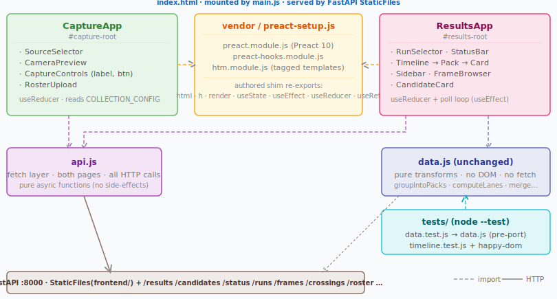

# Design — FE Modernization: Toolchain, Tests, Preact

## 1. Tech Stack

| Concern | Choice | Notes |
|---------|--------|-------|
| UI framework | Preact 10 | ~4 KB; VDOM + hooks; vendored |
| Template syntax | htm 3 | ~1 KB; tagged-template JSX without a compiler; vendored |
| Test runner | `node --test` (built-in) | zero deps; sufficient for pure-logic + one component test |
| DOM shim (component tests) | `happy-dom` | dev dep only; gives Preact a `document` to render into under node |
| Bundler | none | runtime stays buildless; FastAPI serves ESM files directly |
| Language | plain `.js` + JSDoc types | no `.ts`, no emit; authored as JS, shipped as-is |
| Type checker | `tsc --noEmit` (`checkJs`) | dev-only gate; reads JSDoc as types, produces no output (runtime stays buildless — D1) |
| JSX | none | htm tagged templates (OQ4) |

## 2. High-Level Architecture



Both the capture section and the results section live on the **same `index.html`** (as today). The port replaces the two ad-hoc script entries (`app.js` as a classic script + `results/results.js` as a module) with two Preact app roots mounted by a single `main.js` module entry. The HTML otherwise stays minimal — it becomes a shell with two `<div>` roots and a `<script type="module">` tag.

## 3. Repository Layout

Changes relative to `collection/frontend/` today:

```
collection/frontend/
  package.json              ← NEW: dev toolchain manifest
  package-lock.json         ← NEW
  tsconfig.json             ← NEW: type-check config (allowJs + checkJs + noEmit; see §10)
  types.d.ts                ← NEW: shared JSDoc typedefs — the frozen §8/§9 contracts,
                                    machine-enforced (State, Action, Pack, Lane, props)
  vendor/
    preact.module.js        ← NEW: Preact 10 ESM (pinned, vendored)
    preact-hooks.module.js  ← NEW: Preact hooks ESM (pinned, vendored)
    htm.module.js           ← NEW: htm 3 ESM (pinned, vendored)
    preact-setup.js         ← NEW: authored shim (see §5)
    vendor.md               ← NEW: provenance record (name, version, source URL)
  components/
    capture/
      CaptureApp.js         ← NEW (replaces app.js)
      SourceSelector.js     ← NEW
      CameraPreview.js      ← NEW
      CaptureControls.js    ← NEW
      RosterUpload.js       ← NEW
    results/
      ResultsApp.js         ← NEW (replaces results/results.js)
      RunSelector.js        ← NEW
      StatusBar.js          ← NEW (replaces results/status.js)
      Timeline.js           ← NEW (replaces results/render.js)
      Card.js               ← NEW
      Sidebar.js            ← NEW (replaces results/sidebar.js + results/edits.js)
      FrameBrowser.js       ← NEW (replaces results/browser.js)
  api.js                    ← NEW: consolidated fetch layer for BOTH pages (see §7)
  main.js                   ← NEW: mounts both Preact roots
  index.html                ← MODIFIED: two root divs + single module entry
  results/
    data.js                 ← UNCHANGED (pure transforms; moved intact)
  tests/
    setup-dom.js            ← NEW: happy-dom globals, preloaded via --import (see §10)
    data.test.js            ← NEW: pure-logic tests (written pre-port)
    timeline.test.js        ← NEW: component test via happy-dom
  config.js                 ← UNCHANGED
  styles.css                ← UNCHANGED (minor additions for any new elements)

  -- DELETED at integration --
  app.js
  results/results.js
  results/render.js
  results/sidebar.js
  results/browser.js
  results/status.js
  results/edits.js
```

## 4. Vendoring Mechanism

Vendored files are checked into the repo as-is — they are plain ES modules downloaded
from a CDN (esm.sh or unpkg) at a pinned version and committed. No `node_modules`,
no bundler, no import maps required.

**`vendor/vendor.md`** records provenance for each file:

```markdown
| File | Package | Version | Source URL |
|------|---------|---------|------------|
| preact.module.js | preact | 10.x.y | https://... |
| preact-hooks.module.js | preact/hooks | 10.x.y | https://... |
| htm.module.js | htm | 3.x.y | https://... |
```

To update a dep: download the new ESM file, replace the vendor file, update `vendor.md`.
This is scriptable (a one-liner `curl` per file) but requires no build tooling.

## 5. `vendor/preact-setup.js` — Single Import Shim

All components import from **one place**. This shim binds `htm` to Preact's `h` and
re-exports every Preact primitive in common use:

```js
import { h, render, Fragment, createContext } from './preact.module.js';
import { useState, useEffect, useReducer, useRef, useMemo, useCallback } from './preact-hooks.module.js';
import htm from './htm.module.js';

export const html = htm.bind(h);
export { h, render, Fragment, createContext,
         useState, useEffect, useReducer, useRef, useMemo, useCallback };
```

Every component then does:

```js
import { html, useState, useEffect } from '../../vendor/preact-setup.js';
```

If Preact's path ever changes (version bump, CDN swap), one file changes.

## 6. `index.html` — Mount Points

The existing static HTML inside `<body>` is replaced with:

```html
<h1>Frame Collector</h1>
<div id="capture-root"></div>
<div id="results-root"></div>
<datalist id="roster-numbers"></datalist>

<script src="config.js"></script>
<script type="module" src="main.js"></script>
```

`main.js` mounts both roots:

```js
import { h, render } from './vendor/preact-setup.js';
import CaptureApp from './components/capture/CaptureApp.js';
import ResultsApp from './components/results/ResultsApp.js';

render(h(CaptureApp, null), document.getElementById('capture-root'));
render(h(ResultsApp, null), document.getElementById('results-root'));
```

`config.js` stays as a classic synchronous script so `window.COLLECTION_CONFIG` is
set before the module executes.

## 7. `api.js` — Fetch Layer

The **single** fetch layer for the whole FE. It replaces the scattered `fetch` calls in
`results.js`, `edits.js`, `sidebar.js`, `browser.js` **and `app.js`** (capture) — so both
Preact roots talk to the back-end through one testable module (FR15; matches the
`CaptureApp → api.js` edge in §2). All functions are pure async — no globals mutated, no
DOM touched. Every path below is verbatim from the existing wire contract (A2); this
module changes call-sites, never the API.

```js
const BASE = () => window.COLLECTION_CONFIG?.BACKEND_URL ?? '';

// ── reads ──
export async function fetchRuns()                                       // → string[]        GET /runs
export async function fetchResults(runLabel)                            // → raw JSON        GET /results?run=
export async function fetchCandidates(runLabel)                         // → raw JSON        GET /candidates?run=
export async function fetchStatus(runLabel)                             // → raw JSON        GET /status?run=
export async function fetchFrames(runLabel, { anchorTs, spanS, limit }) // → raw JSON        GET /frames?run=… (frame browser)
export async function fetchRoster(runLabel)                             // → riders[]        GET /roster?run= (datalist; see §5/OQ-D2)

// ── results-side mutations ──
export async function postEdit(runLabel, crossingId, fields)                 // → void   PATCH /crossings/{id}  { number?, deleted? }
export async function deleteEdit(runLabel, crossingId)                        // → void   PATCH /crossings/{id}  { deleted:true } — soft-delete; there is no DELETE route
export async function postManualCrossing(runLabel, payload)                  // → void   POST  /crossings
export async function reorderCrossing(runLabel, crossingId, { earlierId, laterId }) // → void   POST /crossings/{id}/position  { earlier_id, later_id } (neighbour-based, per backend)
export async function promoteCandidate(runLabel, candidateId, payload)        // → void   POST  /candidates/{id}/resolve  { action:'promote', number }
export async function dismissCandidate(runLabel, candidateId)                 // → void   POST  /candidates/{id}/resolve  { action:'dismiss' }

// ── capture-side ──
export async function checkHealth()                                     // → boolean         GET  /health
export async function postFrame(payload)                                // → raw JSON        POST /frames (capture upload)
export async function uploadRoster(runLabel, file)                      // → void            POST /roster (CSV upload)

// ── sync URL builders (no fetch) ──
export function frameUrl(runLabel, filename)                            // → string          GET /frames/image?…
```

> **`reorderCrossing` is neighbour-based, not positional.** The backend endpoint
> `POST /crossings/{id}/position` takes `{ earlier_id, later_id }` (today's
> `edits.js:setPosition`), so the signature carries `{ earlierId, laterId }`, **not** a
> numeric index — a positional param would require inventing a wire contract A2 forbids.
> The caller (order-editing UI) resolves the drop target's neighbours and passes them.
>
> **`deleteEdit` maps to a PATCH, not a DELETE** — soft-delete via `{ deleted:true }`.
> Kept as a distinct helper for call-site clarity; there is no `DELETE /crossings/{id}`.

## 8. State Model — `ResultsApp`

A single `useReducer` owns all results-page state. The poll loop runs in a `useEffect`
that dispatches `POLL_RESULTS` / `POLL_STATUS` on each tick.

**State shape** (frozen for all results components to code against):

```js
{
  runs:             string[],
  selectedRun:      string | null,

  // raw transform outputs — data.js applied at poll time, retained so the
  // candidate toggle can recompute the view model without a refetch.
  crossings:        Result[],          // resultsFromCrossings(resultsPayload)
  candidates:       CandidateResult[], // candidatesToResults(candidatesPayload)
  lastPayloadHash:  string,            // string key over the raw /results+/candidates
                                       // JSON; POLL_RESULTS is a no-op on match so
                                       // no new state object is created (Preact then
                                       // bails out of re-render — see NFR2 note below)

  // derived view model — recomputed in the reducer on POLL_RESULTS and
  // TOGGLE_CANDIDATES via deriveView(crossings, candidates, candidatesVisible).
  // See §9 "Types" for Pack / Lane.
  packs:            Pack[],            // groupIntoPacks(sorted, 3) — each Pack = { startTime, results }
  lanes:            Lane[],            // computeLanes(sorted, { laneOrder: null }) — [{ category, index }]

  candidatesVisible: boolean,
  selectedId:       string | null,

  sidebar: {
    open:        boolean,
    item:        Crossing | Candidate | null,
    frameOffset: number,            // step index into surrounding frames
  },
  browser: {
    open:        boolean,
    anchorTs:    string | null,     // ISO timestamp to centre frame browser on
  },

  statusPayload: object | null,
  pollError:     string | null,
}
```

`deriveView` is the port of today's `results.js` render pipeline
(`mergeCandidates` when the toggle is on → `sortByOrder` → `groupIntoPacks` →
`computeLanes`), lifted out of the DOM path into a pure helper. Because it reads
`candidatesVisible` (which lives in state) the derivation must run **inside the
reducer**, not before dispatch — so `POLL_RESULTS` carries the raw transform
outputs, not precomputed `packs`.

> **NFR2 / SC5 note.** `lastPayloadHash` is a *dispatch-level dedupe* (skip
> creating a new state object when the poll payload is byte-identical), letting
> Preact's own VDOM diff be the render-skip. This is deliberately **not** the
> removed DOM-diff machinery of `results.js` (compare-then-manually-patch): no
> DOM is touched here, and SC5's forbidden `reapplySelectionHighlight` /
> `wtnc:edited` mechanisms stay gone. A plain string compare of the raw JSON is
> sufficient — no SHA / `crypto.subtle` needed.

**Action types** (frozen):

```js
{ type: 'SET_RUNS',         runs }
{ type: 'SELECT_RUN',       runLabel }
{ type: 'POLL_RESULTS',     crossings, candidates, hash }  // reducer derives packs+lanes
{ type: 'POLL_STATUS',      status }
{ type: 'TOGGLE_CANDIDATES' }                              // reducer re-derives packs+lanes
{ type: 'SELECT_ITEM',      item }
{ type: 'OPEN_SIDEBAR',     item, frameOffset? }
{ type: 'CLOSE_SIDEBAR' }
{ type: 'STEP_FRAME',       delta }
{ type: 'OPEN_BROWSER',     anchorTs }
{ type: 'CLOSE_BROWSER' }
{ type: 'POLL_ERROR',       error }
```

`CaptureApp` uses its own separate `useReducer` scoped to capture concerns (source,
stream, recording state, inflight count, roster status). Its state shape is an
implementation detail of `CaptureApp.js` — not frozen across tasks.

## 9. Component Contracts (Frozen)

These are the prop signatures all tasks code against. Internal implementation is each
task's responsibility; these signatures are the boundary.

Each signature below is authored as a JSDoc `@typedef` in `types.d.ts` and referenced
by every component's `@param`, so `tsc --noEmit` (§10) **enforces** these contracts
instead of leaving them as prose — a component whose body reads a prop absent from its
declared type (the `lanes`/`column` class of bug this review found) fails the type
check. **Caveat:** htm hides call-sites — `` html`<${Timeline} ...=${x} />` `` is an
opaque template string to `tsc`, so it verifies each component's *own* prop usage and
all non-view code (`data.js`, `api.js`, reducer/actions/state), but does **not** confirm
a parent passed the right props *through* an htm literal. Mount points that matter
(`main.js`) use `h(Component, props)` directly, which is checked.

**Types** (from `data.js`, unchanged — see OQ-D1):

```js
Pack = { startTime: Date, results: Array<Result|CandidateResult> }  // groupIntoPacks
Lane = { category: string, index: number }                          // computeLanes
```

The timeline is a CSS grid of per-category **lanes** (columns): a card's grid
column is `laneByCategory.get(result.category).index + 1`, falling back to
`lanes.length` for uncategorised crossings and candidates. `lanes` therefore
must be threaded through `Timeline → Pack → Card` (it drives both the
`--lane-count` grid variable and each card's column) — it is not optional
styling. The parent computes each card's column and passes it down so `Card`
stays presentational.

### Results components

```js
ResultsApp()                        // no props — self-contained via COLLECTION_CONFIG

RunSelector({
  runs:     string[],
  selected: string | null,
  onChange: (runLabel: string) => void,
})

StatusBar({ status: object | null })

Timeline({
  packs:             Pack[],        // from groupIntoPacks (data.js)
  lanes:             Lane[],        // from computeLanes (data.js); sets grid --lane-count
  candidatesVisible: boolean,
  selectedId:        string | null,
  onSelect:          (item: object) => void,
})

Pack({
  pack:       Pack,                 // { startTime, results } — one gap group
  lanes:      Lane[],               // to resolve each result's grid column
  selectedId: string | null,
  onSelect:   (item: object) => void,
})
// Pack renders a leading <GapSeparator> from pack.startTime, then one
// Card / CandidateCard per result, placing each in its lane column.

Card({
  crossing: object,
  column:   number,                 // 1-based grid column (resolved by Pack from lanes)
  selected: boolean,
  onClick:  () => void,
})

CandidateCard({
  candidate: object,
  column:    number,                // 1-based grid column (resolved by Pack from lanes)
  selected:  boolean,
  onClick:   () => void,
})

GapSeparator({ label: string })     // formatGapLabel(pack.startTime) — a timestamp label,
                                    // matching today's render.js (NOT a between-pack duration).
                                    // formatGapLabel moves to the pure layer and is tested (FR8).

Sidebar({
  item:          object | null,
  frameOffset:   number,
  runLabel:      string,
  onClose:       () => void,
  onStepFrame:   (delta: number) => void,
  onEdit:        (crossingId: string, fields: object) => Promise<void>,
  onDelete:      (crossingId: string) => Promise<void>,
  onPromote:     (candidateId: string, payload: object) => Promise<void>,
  onDismiss:     (candidateId: string) => Promise<void>,
  onOpenBrowser: (anchorTs: string) => void,
})

FrameBrowser({
  runLabel:         string,
  anchorTs:         string | null,
  onClose:          () => void,
  onCreateCrossing: (payload: object) => Promise<void>,
})
```

### Capture components

```js
CaptureApp()                        // no props — self-contained via COLLECTION_CONFIG

SourceSelector({
  value:    string,                 // 'camera' | 'video'
  onChange: (src: string) => void,
})

CameraPreview({ active: boolean })  // manages its own stream ref internally

CaptureControls({
  active:   boolean,
  onStart:  () => void,
  onStop:   () => void,
  inflight: number,
  label:    string,
  onLabel:  (label: string) => void,
})

RosterUpload({
  onUpload: (file: File) => Promise<void>,
  status:   string | null,
})
```

## 10. Test Infrastructure

### Pure-logic tests — `tests/data.test.js`

Written **before** the port, against the current `results/data.js`. Run with:

```bash
node --test tests/data.test.js
```

Covers all exports: `resultsFromCrossings`, `sortByOrder`, `groupIntoPacks`,
`computeLanes`, `candidatesToResults`, `mergeCandidates`. Edge cases: empty input,
unparseable timestamps, duplicate IDs, candidates overlapping confident crossings.

These tests pass unchanged after the port; any breakage during port is a regression,
not an expected diff.

### Component test — `tests/timeline.test.js`

Wires `happy-dom` as a DOM shim so Preact can render under node. The DOM globals must
exist **before** Preact's module graph evaluates, so they are installed by a preloaded
setup module rather than in the test file itself — `import` statements are hoisted and
run before any top-level assignment, so setting `globalThis.window` *between* two
`import` lines would run *after* Preact had already imported. `tests/setup-dom.js`:

```js
// tests/setup-dom.js — preloaded via --import, runs before any test module.
import { Window } from 'happy-dom';
const win = new Window();
globalThis.window = win;
globalThis.document = win.document;
globalThis.customElements = win.customElements;
```

Loaded ahead of the suite through the test script (`§package.json`):

```jsonc
"unit": "node --test --import ./tests/setup-dom.js tests/*.test.js"
```

The test file can then import Preact and components at the top level safely:

```js
import { h, render } from '../vendor/preact-setup.js';
import { Timeline } from '../components/results/Timeline.js';
```

Covers: Timeline renders the correct card count for a given packs array; selecting
a card calls `onSelect` with the right item; candidate cards render/hide with
`candidatesVisible`; `selectedId` applies the selection highlight.

### `package.json` — dev dependencies only

```json
{
  "name": "wtnc-frontend",
  "type": "module",
  "private": true,
  "scripts": {
    "typecheck": "tsc --noEmit",
    "unit":      "node --test --import ./tests/setup-dom.js tests/*.test.js",
    "check":     "npm run typecheck && npm run unit"
  },
  "devDependencies": {
    "typescript": "^5.x.y",
    "happy-dom":  "^x.y.z"
  }
}
```

`npm run check` is the **single documented gate** (FR2): it type-checks then runs the
unit tests. `unit` and `typecheck` remain separately invocable. Both `typescript` and
`happy-dom` are **dev-only** — no runtime dependencies in `package.json`; Preact and htm
are vendored files, not npm packages, and `tsc` emits nothing, so the served tree is
byte-identical with or without node installed (FR4/SC1). Cold `tsc` over a ~20-file FE
is ~1–2 s, well inside the < 10 s budget (FR10).

### Type checking — `tsconfig.json`

`tsc` runs in check-only mode over the authored `.js`; JSDoc annotations (centralised in
`types.d.ts`, §9) are the type source. Vendored ESM is excluded so third-party code is
never checked.

```jsonc
{
  "compilerOptions": {
    "allowJs": true,          // check .js files…
    "checkJs": true,          // …without per-file // @ts-check pragmas
    "noEmit": true,           // check only — never write output (buildless, D1)
    "strict": true,
    "target": "ES2022",
    "module": "ESNext",
    "moduleResolution": "bundler",
    "lib": ["ES2022", "DOM"], // browser globals: document, customElements, MediaStream…
    "skipLibCheck": true
  },
  "include": ["**/*.js", "types.d.ts"],
  "exclude": ["vendor/**", "node_modules"]
}
```

Excluding `vendor/**` means components import Preact/htm as untyped modules; the
`preact-setup.js` re-exports (§5) get lightweight local JSDoc (`@type`) so `html`,
`useState`, etc. carry usable signatures downstream without checking the vendored source.

## 11. Serving (Unchanged)

FastAPI's `StaticFiles` mount on `/` serves the whole `frontend/` directory as-is.
The browser imports `vendor/preact-setup.js`, `components/**/*.js`, `api.js`, and
`results/data.js` as native ES modules. No bundler output, no source maps, no
compile step. `tsc` runs only as a dev-time check (`--noEmit`); it produces no artifact
in the served tree, so `run.sh` and the operator's workflow are identical and node is
never on the serving path.

## 12. Migration Approach

One implementation wave with a blocking scaffold task followed by parallel component
tasks, then a single integration task:

| Phase | Tasks | Dependency |
|-------|-------|------------|
| Scaffold | `package.json`, `tsconfig.json`, `types.d.ts` (frozen §8/§9 typedefs), `vendor/` + typed `preact-setup.js`, test + `tsc` wiring, frozen contracts in `tasks/README.md` | blocks all others |
| Parallel | `tests/data.test.js` · results components (Timeline/Card/Pack/Gap) · Sidebar + FrameBrowser · StatusBar + RunSelector · capture components · `api.js` | all independent (exclusive file ownership); each authored to pass `npm run typecheck` against `types.d.ts` |
| Integration | Mount apps in `main.js` + `index.html`, delete old files, `tests/timeline.test.js`, `npm run check` green (typecheck + unit), verify parity checklist, FE dev docs (§13) | after all parallel tasks |

The old files (`app.js`, `results/*.js` except `data.js`) survive until the
integration task deletes them — they are never edited, only replaced.

## 13. FE Developer Docs (FR5)

A **`collection/frontend/README.md`** (authored in the integration task, linked from
`collection/README.md`) is the FR5 deliverable. It covers, in this order:

- **Layout** — the §3 map: `components/`, `vendor/`, `api.js`, `results/data.js` (pure),
  `tests/`, and the roles of `types.d.ts` / `tsconfig.json`.
- **Running the checks** — `npm ci` once, then:
  - `npm run check` — the gate: type-check + unit tests (run this before every commit).
  - `npm run typecheck` — `tsc --noEmit` alone; catches contract/prop mismatches.
  - `npm run unit` — `node --test` alone; fast logic + component tests.
  - Note: no back-end, browser, or venv needed; nothing is emitted or served (FR4).
- **Types & contracts** — **where shared types live and how to extend them:**
  - `types.d.ts` holds the frozen contracts (`State`, `Action`, `Pack`, `Lane`, and each
    component's props `@typedef`). It is the single source of truth from §8/§9.
  - Components are plain `.js`; they *reference* these types via JSDoc —
    `/** @param {import('../../types').TimelineProps} props */` (extension-less: TS
    resolves the specifier to `types.d.ts`; writing `…/types.d.ts` explicitly is a `tsc`
    error under `moduleResolution: bundler`) — rather than redeclaring them. `checkJs`
    then verifies each component against the shared contract.
  - To add/extend a component: define or update its props `@typedef` in `types.d.ts`
    first, annotate the component's `@param`, and run `npm run typecheck`.
  - The htm blind spot (from §9): `tsc` checks a component's *own* prop usage but not
    props threaded through `` html`` `` literals — so keep prop names exact and lean on
    the component test (`tests/timeline.test.js`) for call-site wiring.
- **Adding a component** — new file under `components/<page>/`, import primitives from
  `vendor/preact-setup.js` (§5), type its props in `types.d.ts`, wire it into its parent,
  add coverage if it carries logic.
- **Updating a vendored dep** — the §4 procedure: `curl` the pinned ESM into `vendor/`,
  re-point the hooks import to `./preact.module.js` if needed, bump `vendor/vendor.md`,
  run `npm run check`. No build step.

## 14. Open Questions (for human review before tasks)

- **OQ-D1 — `Pack` / `Lane` shape.** ✅ **Resolved — keep `data.js` untouched; adapt
  in the component layer.** Correction: `groupIntoPacks` already returns `Pack[]` where
  each pack is `{ startTime, results }` (not an array of arrays), and `computeLanes`
  returns `Lane[]` of `{ category, index }` — these are the frozen types in §9. Gaps are
  **not** a `data.js` concept: today the timeline renders exactly one separator per pack,
  labelled `formatGapLabel(pack.startTime)`, and lane *columns* (not gaps) come from
  `computeLanes`. So there is nothing to change in `data.js` — editing its return shape
  would violate §3 ("`data.js` UNCHANGED") and, worse, break D6/FR7/SC2 (the pre-port
  `data.test.js` must pass unchanged). The `Timeline`/`Pack`/`Card` contracts consume
  `packs` + `lanes` directly and resolve per-card columns in the component layer; the
  only pure logic that relocates is `formatGapLabel` (render.js → pure layer, tested per
  FR8). No frozen-contract action beyond §9 as written.
- **OQ-D2 — `#roster-numbers` datalist.** ✅ **Resolved — keep it a shared static
  element in the `index.html` shell.** It has **two** consumers, not one: both `Sidebar`
  (`sidebar.js`) and `FrameBrowser` (`browser.js:450`) attach inputs to it via
  `list="roster-numbers"`. Moving ownership into `Sidebar`'s render output would remove
  the datalist from the DOM whenever the sidebar is closed but the frame browser is open,
  silently breaking roster autocomplete there. Instead the top-level
  `<datalist id="roster-numbers">` **stays** in `index.html` (already shown in §6), and
  whichever overlay is open populates its `<option>`s (a small `setRosterOptions(run)`
  helper in `api.js`/a shared module, replacing `edits.js`'s `loadRosterNumbers`). This
  is a shared read-only DOM node by design, not component-owned state — no cross-task
  ownership conflict.
- **OQ-D3 — `CameraPreview` stream lifecycle.** The current `app.js` acquires the
  media stream imperatively. In Preact, stream acquisition belongs in a `useEffect`.
  The component contract says `CaptureApp` passes `active: boolean` to `CameraPreview`;
  the decision of whether `CaptureApp` or `CameraPreview` owns the `getUserMedia` call
  is left to the capture task but must be settled before that task starts.
