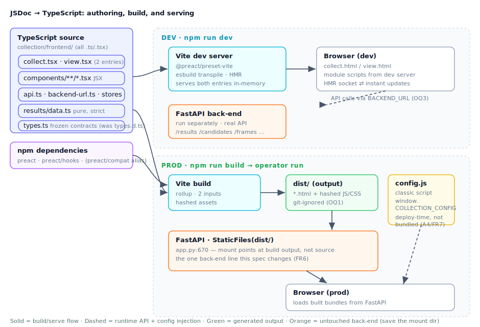

# Design — JSDoc → TypeScript: JSX, npm deps, bundler

## 1. Tech Stack

| Concern | Choice | Notes |
|---------|--------|-------|
| Language | TypeScript 5.x, `.ts`/`.tsx` | replaces `.js` + JSDoc; `strict` retained |
| UI framework | Preact 10 (npm) | retained (req D2); `preact` + `preact/hooks` |
| JSX runtime | `react-jsx` w/ `jsxImportSource: "preact"` | automatic runtime; no `h` import in components |
| React-compat escape hatch | `preact/compat` alias (configured, unused) | lets a future React-only dep resolve without shipping React |
| Bundler + dev server | **Vite 5** + `@preact/preset-vite` | native multi-entry, HMR, esbuild transpile, rollup prod build (OQ2) |
| Test runner | **Vitest** | reuses the Vite/TS config; `happy-dom` env carries over from today |
| DOM env (tests) | `happy-dom` | already a dev dep; Vitest `environment: 'happy-dom'` |
| Prod serving | FastAPI `StaticFiles(dist/)` | build output, not source (req FR6) |
| Vendored deps | **none** | `vendor/*.module.js`, `preact-setup.js`, htm deleted (req FR5) |

Rationale for Vite over bare esbuild: the owner asked for a dev server + HMR (req FR3) and
real JSX; `@preact/preset-vite` wires JSX + `preact/compat` + HMR in one line and rollup
handles the two-entry prod build with hashed assets. Vitest piggybacks on that same config,
so there is a single toolchain rather than esbuild + a separate runner.

## 2. High-Level Architecture



The port keeps **one source tree, two consumption paths**. In **dev**, Vite transpiles and
serves the `.tsx` sources in-memory with HMR; the browser hits `collect.html` / `view.html`
served by Vite, and the app talks to a separately-running FastAPI via the runtime
`BACKEND_URL` (§5, OQ3) — no proxy needed because `backend-url.ts` already targets an
absolute backend. In **prod**, `vite build` emits hashed bundles for both entries into
`dist/`, and FastAPI's `StaticFiles` mount points at `dist/` instead of the source tree —
the single back-end change (§6). `config.js` stays a classic pre-module `<script>` in both
paths, so `window.COLLECTION_CONFIG` is deployment state, never bundled (§7).

The type surface and component contracts are **preserved, not redesigned**: `types.d.ts`
becomes `types.ts`, and the frozen prop/state/action shapes from the `fe-modernization`
design §8/§9 remain the boundary between tasks — now enforced at JSX call-sites too, closing
the htm blind spot that spec called out.

## 3. Repository Layout

Changes relative to `collection/frontend/` today (all `.js` → `.ts`/`.tsx`; representative,
not exhaustive — every source module converts):

```
collection/frontend/
  package.json              ← MODIFIED: + vite, @preact/preset-vite, vitest, preact
  package-lock.json         ← MODIFIED
  vite.config.ts            ← NEW: preset-vite, 2-entry build, vitest config, compat alias
  tsconfig.json             ← MODIFIED: jsx runtime; drop allowJs/checkJs; noEmit stays (Vite transpiles)
  types.ts                  ← NEW (was types.d.ts): real exported TS types, unchanged shapes
  index.html                ← MODIFIED: landing (unchanged content); Vite HTML input
  collect.html              ← MODIFIED: references collect.tsx entry (+ config.js pre-script)
  view.html                 ← MODIFIED: references view.tsx entry (+ config.js pre-script)
  collect.tsx               ← NEW (was collect.js): entry, mounts CaptureApp root
  view.tsx                  ← NEW (was view.js): entry, mounts ResultsApp root
  api.ts                    ← NEW (was api.js)
  backend-url.ts            ← NEW (was backend-url.js)
  config.js                 ← UNCHANGED (classic script; not bundled — §7)
  components/
    capture/*.tsx           ← NEW (CaptureApp, SourceSelector, CameraPreview, …)
    common/BackendSettings.tsx ← NEW
    results/*.tsx            ← NEW (ResultsApp, Timeline, Card, Sidebar, FrameBrowser, …)
    results/{download,format,roster,state}.ts ← NEW (logic helpers, no JSX)
  results/
    data.ts                 ← NEW (was data.js + data.d.ts): de-quarantined, strict (§8)
  vitest.setup.ts           ← NEW (was tests/setup-dom.js): happy-dom globals if still needed
  tests/*.test.ts           ← NEW (was *.test.js): Vitest specs
  styles.css                ← UNCHANGED (Vite serves/emits as an asset)

  -- DELETED --
  types.d.ts                (→ types.ts)
  results/data.d.ts         (sidecar folds into data.ts — §8)
  vendor/                   (preact.module.js, preact-hooks.module.js, htm.module.js,
                             preact-setup.js, vendor.md — all removed; deps now npm)
  tests/setup-dom.js        (→ vitest.setup.ts)

  -- GENERATED (git-ignored, OQ1) --
  dist/                     ← vite build output that FastAPI serves in prod
  node_modules/
```

## 4. Build & Dev Workflow

### `vite.config.ts`

```ts
import { defineConfig } from 'vite';
import preact from '@preact/preset-vite';

export default defineConfig({
  root: '.',                                  // collection/frontend
  plugins: [preact()],                        // JSX + preact/compat alias + HMR
  build: {
    outDir: 'dist',
    rollupOptions: {
      input: {                                // multi-page: one bundle per page (req A3/FR12)
        index:   'index.html',
        collect: 'collect.html',
        view:    'view.html',
      },
    },
  },
  test: {                                     // Vitest, sharing this config
    environment: 'happy-dom',
    setupFiles: ['./vitest.setup.ts'],
    include: ['tests/**/*.test.ts'],
  },
});
```

### `package.json` scripts

```jsonc
{
  "scripts": {
    "dev":       "vite",                      // dev server + HMR (FR3)
    "build":     "vite build",                // dist/ for prod (FR2)
    "preview":   "vite preview",              // sanity-check the built bundle
    "typecheck": "tsc --noEmit",              // type gate (Vite doesn't type-check)
    "unit":      "vitest run",                // tests (FR15)
    "check":     "npm run typecheck && npm run unit"  // the single gate (FR4)
  }
}
```

> **`tsc` still only type-checks.** Vite/esbuild transpiles per-file and does **not**
> type-check, so `tsc --noEmit` stays the type authority (now over `.ts`/`.tsx`, no
> `checkJs`). `npm run check` = types + tests, exactly as today's gate — just retargeted.

### `tsconfig.json` (modified)

```jsonc
{
  "compilerOptions": {
    "strict": true,
    "target": "ES2022",
    "module": "ESNext",
    "moduleResolution": "bundler",
    "lib": ["ES2022", "DOM"],
    "jsx": "react-jsx",                 // NEW: automatic JSX runtime
    "jsxImportSource": "preact",        // NEW: JSX compiles to preact/jsx-runtime
    "types": ["vite/client"],           // NEW: import.meta.env etc.
    "noEmit": true,                     // Vite emits; tsc only checks
    "skipLibCheck": true
    // REMOVED: allowJs, checkJs — sources are .ts now
  },
  "include": ["**/*.ts", "**/*.tsx"],
  "exclude": ["dist", "node_modules"]
}
```

## 5. Dev-mode Back-end Wiring (OQ3 → resolved)

The `page-split` spec already gave the FE a runtime-configurable backend via
`backend-url.ts` + `window.COLLECTION_CONFIG.BACKEND_URL`. So **dev needs no proxy**: run
FastAPI as usual (its own port), start `vite` (its own port), and set `BACKEND_URL` to the
FastAPI origin via `config.js` (or a dev `.env`/`import.meta.env` fallback in
`backend-url.ts`'s default). `api.ts` already prefixes every request with that base. This is
simpler than a Vite `server.proxy` block and exercises the exact same cross-origin path the
`page-split` feature ships. (A proxy remains a fallback if CORS on the dev FastAPI is
inconvenient — but the back-end already serves the FE cross-origin by design.)

## 6. Back-end Serving Change (the one Python touch)

`app.py:668-670` today:

```python
_frontend_dir = os.path.normpath(os.path.join(os.path.dirname(__file__), "..", "frontend"))
app.mount("/", StaticFiles(directory=_frontend_dir, html=True), name="static")
```

becomes a mount at the build output:

```python
_frontend_dist = os.path.normpath(os.path.join(os.path.dirname(__file__), "..", "frontend", "dist"))
app.mount("/", StaticFiles(directory=_frontend_dist, html=True), name="static")
```

This is the **only** back-end edit (req D5/NFR2). Its Python test (if any asserts the mount
dir) updates alongside. Consequence: the app now requires a built `dist/` to serve — see §11
for how that is produced. No route, payload, or handler changes.

## 7. Runtime Config Injection (preserved — OQ6)

`config.js` must stay a **classic, non-module `<script>` that runs before the entry module**,
so `window.COLLECTION_CONFIG` exists when the app boots — bundling it would freeze deploy
config into the build. In both dev and prod the page HTML is:

```html
<!-- collect.html / view.html -->
<script src="config.js"></script>              <!-- classic, un-bundled, deploy-time -->
<script type="module" src="/collect.tsx"></script>   <!-- Vite rewrites to hashed asset on build -->
```

Vite treats the HTML as a build input, transpiles/renames the module script to the hashed
`dist/assets/*.js`, and **leaves the classic `config.js` script tag alone** (it is a
plain public asset, copied verbatim). `config.js` is placed in Vite's `publicDir` (or kept
at root and referenced with an absolute `/config.js`) so it is copied to `dist/` unhashed and
remains operator-editable post-build (req FR7/SC6). `backend-url.ts` reads it exactly as
today.

## 8. `data.js` De-quarantine (OQ4 → resolved: port-and-fix)

`results/data.js` + its `data.d.ts` sidecar collapse into a single strict `results/data.ts`.
The sidecar existed only because `checkJs` would have surfaced the module's loose spots in
every consumer; under TS those spots are fixed at the source instead of hidden:

- **Date arithmetic** (`a.time - b.time` on `Date`) → `a.time.getTime() - b.time.getTime()`
  (behavior-identical; TS rejects `Date` subtraction).
- **Widened boolean/string literals** (`isCandidate: false`, `category: "Unknown"`) →
  annotated with the literal types the frozen `Result`/`CandidateResult` shapes already
  declare, or `as const` where needed.
- **Loose `any` payload params** stay `unknown`/typed-input at the boundary so the pre-port
  edge-case tests (malformed input) still compile and run.

**Constraint:** this is a *type* change only. The runtime output is identical, proven by the
existing `data` test suite passing unchanged in substance (req FR13/NFR6/SC3). The suite is
the regression net; write the conversion to it, not around it.

## 9. htm → JSX Conversion (the bulk of the work)

Each component's render body converts from an htm tagged template to JSX. The pattern
(illustrated on `Card`, the reference component converted in the scaffold wave):

**Before (htm):**
```js
import { html } from '../../vendor/preact-setup.js';
export function Card({ crossing, column, selected, onClick }) {
  const r = /** @type {import('../../types').Result} */ (crossing);
  return html`<div class=${classes} style=${{ gridColumn: column }} onClick=${onClick}>
    ${r.source === 'manual' ? html`<span class="badge badge--manual">✚ manual</span>` : null}
    <span class="card__number">${numberText}</span>
  </div>`;
}
```

**After (JSX/TSX):**
```tsx
import type { CardProps, Result } from '../../types';
export function Card({ crossing, column, selected, onClick }: CardProps) {
  const r = crossing as Result;
  return (
    <div class={classes} style={{ gridColumn: column }} onClick={onClick}>
      {r.source === 'manual' ? <span class="badge badge--manual">✚ manual</span> : null}
      <span class="card__number">{numberText}</span>
    </div>
  );
}
```

Conversion rules (frozen in `tasks/README.md` so every parallel task matches):
- **Keep `class`, not `className`** (OQ5) — Preact accepts it; smaller, exact-parity diff.
  Standard DOM attrs/events stay verbatim (`onClick`, `for`, etc.).
- **No `h`/`html` import** — the automatic JSX runtime (§1) injects it. Delete every
  `preact-setup.js` import; import hooks directly from `preact/hooks`.
- **Props typed by annotation**, not JSDoc: `({ ... }: TimelineProps)` referencing `types.ts`.
- **Inline casts** `/** @type {X} */ (v)` → `v as X`.
- **Fragments** → `<>…</>` (or `Fragment` from `preact`).
- Rendered DOM (tags, classes, attribute values, handler wiring) is **byte-for-byte the same
  output** — this is re-syntaxing, not restyling (req FR11/G5).

## 10. Type Surface: `types.d.ts` → `types.ts`

The frozen contracts move verbatim in shape; only the mechanics change:
- Ambient `.d.ts` → a real module `types.ts` with `export interface`/`export type` (already
  how `types.d.ts` is written — the file is nearly copy-move; the `.d.ts`→`.ts` rename plus
  dropping the "referenced via `import('../types')` JSDoc" comment block).
- Components `import type { TimelineProps } from '../../types'` and annotate params.
- The `data.d.ts` re-exports fold into `data.ts` directly (§8).
- **Contracts do not weaken** (req FR10): the `Result`, `CandidateResult`, `Pack`, `Lane`,
  `State`, `Action` union, and every `*Props` interface from the `fe-modernization` design
  §8/§9 remain the enforced boundary. New: JSX call-sites are now checked, so a parent
  passing a wrong prop through `<Timeline …/>` fails `tsc` — the htm blind spot is closed
  (req FR16).

## 11. Producing `dist/` for the operator (OQ1 → resolved)

`dist/` is **git-ignored**; a one-time `npm run build` is a documented deploy prerequisite,
run whenever the FE changes. Rationale: committing hashed build artifacts pollutes diffs
(req NFR4) and invites drift between source and built output; the app is run by a technical
operator who can run one build command. This means **node is required to build the FE** but
**not to serve it** — FastAPI serving `dist/` needs only Python at runtime, so `run.sh`'s
Python serving path is unchanged. `run.sh`/README documents: `npm ci && npm run build` once
(or after FE edits), then start the back-end as today. (If a fully node-free clone-to-run is
later wanted, a committed `dist/` or a CI-built artifact is a reversible follow-up — not this
spec.)

## 12. Test Migration (`node --test` → Vitest)

The 8 suites port with minimal change — assertions are unchanged; only the harness swaps:
- `node:test`'s `test()/describe()` → Vitest's (near-identical API) or kept via Vitest's
  `node:test` compat; imports of components resolve to `.tsx` through Vite's transform.
- `tests/setup-dom.js` (installs `happy-dom` globals) → `vitest.setup.ts`; Vitest's
  `environment: 'happy-dom'` may make the manual global install unnecessary — the setup file
  shrinks to whatever residue remains.
- The `data` suite is the **de-quarantine regression net** (§8): it must pass unchanged in
  substance (req SC3).
- Component tests (`timeline.test`, `card-badges.test`, `sidebar-reorder.test`) render
  components under `happy-dom` via Vitest and assert on output/interaction, as today.

## 13. Migration Approach

One implementation run: a blocking scaffold wave, parallel conversion, then integration.
File ownership is exclusive per task (this repo's rule); the scaffold freezes the conversion
conventions and the type surface everyone codes against.

| Phase | Tasks | Dependency |
|-------|-------|------------|
| **Wave A — Scaffold** (blocking) | `package.json` deps + `vite.config.ts` + `tsconfig` (jsx); `types.d.ts`→`types.ts`; delete `vendor/`; convert **one reference component end-to-end** (`Card.tsx`) + freeze the §9 conversion rules and §10 type conventions in `tasks/README.md`; wire `npm run check` (tsc + vitest) green on the converted slice | blocks all |
| **Wave B — Parallel convert** | results components (Timeline/Pack/Card-siblings/Gap) · Sidebar + FrameBrowser · StatusBar/RunSelector/common · capture components · `api.ts` + `backend-url.ts` + stores · `results/data.ts` de-quarantine (§8) · logic helpers (format/roster/download/state) · test ports | all independent (exclusive files); each authored to pass `npm run typecheck` against `types.ts` |
| **Wave C — Integration** | Entry modules `collect.tsx`/`view.tsx` + HTML wiring (§7); `app.py` `StaticFiles(dist/)` (§6) + its test; `.gitignore dist/`; delete all remaining `.js`/`vendor`/sidecars; `npm run build` + `npm run check` green; parity checklist (NFR5) against a real run; FE README + CLAUDE.md updates (FR17/FR18) | after all of Wave B |

The old `.js` files survive (unedited) until Wave C deletes them — replaced, never edited,
so a half-converted tree never ships.

## 14. Open Questions (for human review before tasks)

- **OQ-D1 — Vite major version & preset pinning.** Pin Vite 5 vs. latest, and
  `@preact/preset-vite` compatible range. ✅ *Leaning:* latest stable Vite at task time,
  pinned in the lockfile; confirm no Node-version conflict (dev machine is Node 25). Low
  risk; resolve at scaffold.
- **OQ-D2 — Does `happy-dom` env obviate the manual setup file?** Vitest's
  `environment: 'happy-dom'` may fully replace `setup-dom.js`'s global install. Decide
  whether `vitest.setup.ts` survives or is deleted — a scaffold-time spike answers it
  against one component test.
- **OQ-D3 — `config.js` location: root vs `publicDir`.** It must be copied to `dist/`
  unhashed and stay operator-editable (§7). Confirm whether it lives at frontend root
  referenced as `/config.js`, or moves into a Vite `public/` dir. Either works; pick the
  one that keeps the deploy story simplest.
- **OQ-D4 — Landing `index.html` as a build input.** `index.html` is a static landing with
  no script (A3). Confirm it is still a Vite input (so it lands in `dist/`) even though it
  bundles nothing — likely yes, to keep the three-page site whole under one `dist/`.
- **OQ-D5 — Keep `tsc` as the type gate, or lean on `vue-tsc`-style plugin?** For `.tsx`
  Preact, plain `tsc --noEmit` suffices (no `.vue`-style SFCs). ✅ *Leaning:* plain `tsc`,
  no extra checker — confirm no JSX-in-tsc friction with `jsxImportSource: preact`.
