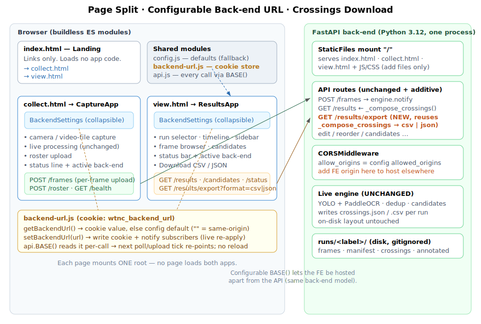

# Design — Page Split, Configurable Back-end URL & Crossings Download

Source of truth: `requirements.md` (G1–G5, FR1–FR17, D1–D4, resolved OQ1–OQ4). This
document is *how*: the page/asset layout, the runtime back-end-URL store, the `api.js`
rewiring, the shared settings component, the download endpoint, and the CORS story. It
freezes the contracts the task files will code against.



## 1. Overview

Three physical HTML pages replace today's single `index.html` that mounts both roots:

| Page | File | Mounts | Talks to back-end for |
|------|------|--------|-----------------------|
| Landing | `index.html` | nothing (links only) | — |
| Collector | `collect.html` | `CaptureApp` | `POST /frames`, `POST /roster`, `GET /health` |
| Viewer | `view.html` | `ResultsApp` | `GET /results`, `/candidates`, `/status`, `/runs`, `/frames*`, `/roster`, edit/reorder/candidate mutations, `GET /results/export` |

A new **cookie-backed store** (`backend-url.js`) holds the runtime back-end base URL. The
**entire** `api.js` layer routes through `BASE()`, which reads that store per call — so the
poll loop (viewer) and capture loop (collector) re-point on their next tick with no reload
("live re-apply", OQ2). A shared **`BackendSettings`** component (collapsible, OQ1) edits
the URL and shows a reachability indicator; the active target is surfaced in each page's
processing-status area (OQ2, OQ4).

The back-end is **additive only** (G4/FR17): serve three files instead of one (StaticFiles
already does `html=True`), factor the crossing-composition out of `GET /results` and reuse
it for a new `GET /results/export`, and rely on the existing `CORSMiddleware` for
cross-origin hosting. The CV engine, frame-upload contract, and on-disk layout are
untouched.

## 2. Page & asset layout

```
collection/frontend/
  index.html          # REPURPOSED: landing page (links to collect.html / view.html)
  collect.html        # NEW: loads config.js + backend-url via collect.js; mounts CaptureApp
  view.html           # NEW: datalist#roster-numbers + loads view.js; mounts ResultsApp
  collect.js          # NEW entry: render(h(CaptureApp,null), #capture-root)
  view.js             # NEW entry: render(h(ResultsApp,null), #results-root)
  main.js             # DELETED (mounted both roots)
  config.js           # EDIT (comment only): BACKEND_URL is now the *default* fallback
  backend-url.js      # NEW: cookie-backed runtime base-URL store
  api.js              # EDIT: BASE()←store; every call + frameUrl via BASE; +export helpers
  components/
    common/
      BackendSettings.js   # NEW: collapsible URL editor + health indicator (shared)
    capture/CaptureApp.js  # EDIT: render <BackendSettings/>; status line shows target; subscribe
    results/
      ResultsApp.js        # EDIT: render <BackendSettings/>; subscribe → reset+repoll on change
      download.js          # NEW: downloadResults(run, format) — blob→anchor (DOM lives here)
  styles.css          # EDIT (single owner): landing, settings panel, download buttons
  types.d.ts          # EDIT: add BackendSettings/export typedefs
```

**Load order (each app page).** `config.js` is a classic script (sets
`window.COLLECTION_CONFIG`) and must precede the module entry, exactly as today:

```html
<!-- collect.html / view.html -->
<script src="config.js"></script>
<script type="module" src="collect.js"></script>   <!-- or view.js -->
```

`backend-url.js` and `api.js` are ES modules imported through the entry — no extra
`<script>` tags. The landing `index.html` loads neither `config.js` nor a module (FR2).

**Datalist.** The shared `<datalist id="roster-numbers">` (FROZEN-8 of fe-modernization)
moves from the old `index.html` into **`view.html`** only — it is used solely by the results
overlays. The collector page does not include it.

**StaticFiles.** Unchanged mount (`app.mount("/", StaticFiles(directory=frontend,
html=True))`). `html=True` already serves `index.html` at `/`; `collect.html`/`view.html`
are reachable by name. No back-end routing change for the split.

## 3. `backend-url.js` — runtime base-URL store (FROZEN)

Single ownership of the configurable URL. Pure browser module; no framework import.

```js
// backend-url.js
const COOKIE = 'wtnc_backend_url';
const DEFAULT = () => (window.COLLECTION_CONFIG?.BACKEND_URL ?? '');

/** Normalize: trim; drop a single trailing '/'. '' means same-origin. */
export function normalizeBackendUrl(raw: string): string;

/** Cookie value if present (decoded+normalized), else the config default. */
export function getBackendUrl(): string;

/** Persist to cookie (path=/, max-age≈1yr, SameSite=Lax) and notify subscribers.
 *  Passing '' clears the override (reverts to default). */
export function setBackendUrl(url: string): void;

/** Subscribe to changes; returns an unsubscribe fn. Fires after setBackendUrl. */
export function onBackendUrlChange(cb: (url: string) => void): () => void;

/** Human label for the status line: '' → 'same-origin', else the URL's host[:port]. */
export function backendLabel(url: string): string;
```

- **Cookie**: `wtnc_backend_url=<encodeURIComponent(url)>; path=/; max-age=31536000;
  SameSite=Lax`. Read via `document.cookie`. No back-end involvement (it is not sent as a
  request credential; the API does not read it).
- **Default fallback**: an install that never touches the setting gets `''` (same-origin) —
  today's behavior verbatim (FR7).
- **Subscribers**: an in-module `Set<cb>`; `setBackendUrl` writes the cookie then calls each.
  This drives the live re-apply reactions in §5.

## 4. `api.js` rewiring (FROZEN surface — supersedes fe-modernization FROZEN-6)

The fix has two parts (both required by FR8):

**(a) Source `BASE()` from the store, not the frozen constant.**
```js
import { getBackendUrl } from './backend-url.js';
const BASE = () => getBackendUrl();     // was: COLLECTION_CONFIG?.BACKEND_URL ?? ''
```

**(b) Route every path through `BASE()`.** Fold it into the one `_fetch` helper so all
`_fetch` callers inherit it, fix the two non-`_fetch` spots, and drop the now-redundant
manual prefixes:

```js
async function _fetch(path, init) {              // path is always a leading-slash API path
  const resp = await fetch(BASE() + path, init); // ← prepend BASE() here, once
  /* …unchanged error handling… */
}
```

| Call | Today | After |
|------|-------|-------|
| `fetchRuns/Results/Candidates/Status/Frames/Roster`, all `/crossings…`, `/candidates…` mutations | bare `/path` via `_fetch` | **BASE()+path** via `_fetch` (one-line fix covers all) |
| `postFrame`, `uploadRoster` | manual `` `${BASE()}/frames` `` etc. | pass `'/frames'` to `_fetch`; **remove** manual prefix (no double base) |
| `checkHealth` | `` fetch(`${BASE()}/health`) `` (raw fetch) | `` fetch(BASE() + '/health') `` (keep raw; still via BASE) |
| `frameUrl(run, filename)` | returns bare `/frames/image?…` | returns **`BASE() + '/frames/image?…'`** |

**New export helpers** (keep `api.js` DOM-free — the anchor lives in `download.js`):
```js
/** Sync URL builder for the export endpoint. */
export function exportUrl(run: string, format: 'csv'|'json'): string;   // BASE()+`/results/export?run=…&format=…`
/** Pure fetch → Blob (throws via _fetch on non-2xx). */
export async function fetchExportBlob(run: string, format: 'csv'|'json'): Promise<Blob>;
```

No wire paths change except the additive `/results/export`; the fetch layer stays the single
communication seam (parity with fe-modernization NFR/A2).

## 5. `BackendSettings` — shared settings + indicator (FROZEN props)

`components/common/BackendSettings.js`, imported by **both** `CaptureApp` and `ResultsApp`.

```ts
export interface BackendSettingsProps {}   // self-contained via backend-url.js
```

**Render (two zones):**
- *Summary row (always visible)* — the canonical "which back-end + reachable" indicator
  (OQ2). Shows `Back-end: <backendLabel(url)>` + a health dot (grey checking / green
  reachable / red unreachable) + a disclosure toggle (▸/▾). Collapsed by default (OQ1).
- *Expanded panel* — a text `<input>` prefilled with the current value (placeholder
  `same-origin (default)`), a **Save** button (`setBackendUrl(input)`), and **Use default**
  (`setBackendUrl('')`).

**Health probe.** A `useEffect` keyed on the current URL runs `api.checkHealth()` →
`checking` → `ok`/`unreachable`. It re-runs when the URL changes (component subscribes to
`onBackendUrlChange`, or reads a `url` state it also sets on Save). No polling loop of its
own beyond an initial probe per URL (a wrong URL is diagnosable per FR9/NFR3 without adding
request load).

**Live re-apply (OQ2) — who reacts to `onBackendUrlChange`:**
- **`api.BASE()`** picks up the new base automatically on the next call — no wiring needed;
  this alone satisfies FR10 for in-flight poll/upload loops.
- **`ResultsApp`** subscribes and, on change, dispatches a reset (clear `runs` +
  `selectedRun`) and re-runs the runs/results load immediately, so the viewer visibly
  re-points at once instead of after a tick, and stale runs from the old back-end vanish.
- **`CaptureApp`** subscribes and, on change, stops any active recording (the upload target
  moved) and re-runs its mount-time health check.

**Status-area integration (OQ2/OQ4):**
- *Collector*: `CaptureApp` renders `<BackendSettings/>` at the top; its existing
  `<p id="status">` line appends `· back-end: <backendLabel>` so the live processing status
  names the target (OQ4 keeps the status line and its sent/dropped/last info).
- *Viewer*: `ResultsApp` renders `<BackendSettings/>` in the toolbar, adjacent to
  `StatusBar`, so the target sits in the processing-status region. `StatusBar` itself is
  **unchanged** (its hidden-when-disabled behavior is preserved); the always-visible
  BackendSettings summary is the target indicator.

## 6. Crossings download (FR12–FR15)

### 6.1 Back-end — one additive route, reuse `/results` composition (OQ3)

Refactor the crossing-dict list-building out of `get_results` into a helper, then reuse it:

```python
def _compose_crossings(run: str) -> tuple[str, list[dict]]:
    """The exact list GET /results returns (reviewed state: edits, manual, order;
    soft-deleted excluded). engine is None → (safe_label, [])."""
```

`GET /results` returns `{"run": run_id, "crossings": _compose_crossings(run)[1]}` — byte-for-
byte its current body, now via the helper (keeps CSV/JSON in lockstep with the timeline).

```python
@app.get("/results/export")
async def export_results(run: str = "", format: str = "json"):
    run_id, crossings = _compose_crossings(run)          # ordered by order_key ASC
    if format == "json":
        body = json.dumps({"run": run_id, "crossings": crossings})
        return Response(body, media_type="application/json",
                        headers={"Content-Disposition": f'attachment; filename="crossings_{run_id}.json"'})
    if format == "csv":
        text = _crossings_csv(crossings)                 # header + rows via csv module
        return Response(text, media_type="text/csv",
                        headers={"Content-Disposition": f'attachment; filename="crossings_{run_id}.csv"'})
    raise HTTPException(status_code=400, detail="format must be 'csv' or 'json'")
```

- **CSV columns (FROZEN):** header `number,time,name,category`; one row per crossing in
  **`order_key` ascending** (chronological). `number` may be empty (unidentified); `name`/
  `category` empty when unmatched. Written with the stdlib `csv` module (correct quoting).
- **JSON:** identical shape to `GET /results` (full per-crossing records, FR14).
- **Empty / disabled (FR15):** `_compose_crossings` returns `[]` → header-only CSV /
  `{"run": …, "crossings": []}` JSON, HTTP 200 — never an error.
- Route registered **before** the StaticFiles mount (like every API route), so `/results/export`
  is not shadowed by static serving.

### 6.2 Front-end — `download.js` + viewer control

```js
// components/results/download.js  (DOM lives here, not in api.js)
export async function downloadResults(run, format) {   // 'csv' | 'json'
  const blob = await api.fetchExportBlob(run, format);
  const url  = URL.createObjectURL(blob);
  const a = Object.assign(document.createElement('a'),
                          { href: url, download: `crossings_${run}.${format}` });
  document.body.appendChild(a); a.click(); a.remove();
  URL.revokeObjectURL(url);
}
```

`ResultsApp` toolbar gains two buttons — **Download CSV** / **Download JSON** — each calling
`downloadResults(state.selectedRun, fmt)`, disabled when no run is selected. Using a
`fetch`→blob (not a bare `<a href>`) makes the download work cross-origin and lets us set the
filename ourselves regardless of the response's `Content-Disposition`.

## 7. Cross-origin hosting & CORS (FR11)

When the FE is served from origin A but points `BASE()` at back-end B, the browser makes
cross-origin requests; B must allow A. The app **already** installs `CORSMiddleware` with
`cfg.allowed_origins`, sourced from `config.yaml → server.allowed_origins` (a list). So:

- **Default localhost install: unchanged.** `config.yaml` already lists the localhost:8000/
  8001 origins; same-origin use needs nothing new.
- **Hosting the FE elsewhere: config-only.** Add the FE's origin to `server.allowed_origins`
  and restart. Documented in the READMEs (NFR6). No code change.
- **Wildcard note (not adopted):** `allow_origins=["*"]` is incompatible with the app's
  `allow_credentials=True`; since the API does not depend on credentialed cookies, a future
  spec could flip `allow_credentials=False` to enable `"*"`, but this iteration keeps the
  explicit-origins model to avoid changing existing behavior.

`Content-Disposition` is a simple response header and needs no CORS expose-headers entry for
the blob-download path (we set the filename client-side).

## 8. Back-end change summary (additive only — FR17/NFR4)

| File | Change |
|------|--------|
| `app.py` | Extract `_compose_crossings(run)` from `get_results`; add `GET /results/export` + `_crossings_csv` helper. Nothing else. |
| `config.yaml` | (Data only) document/extend `server.allowed_origins` for remote hosting. |
| `backend/tests/` | New `test_export.py`: csv/json bodies, order, empty run, disabled mode, bad format → 400; a test that export matches `/results` composition. |

The engine, frame pipeline, dedup/candidates, `models.py`/`AppConfig`, and the `runs/`
layout are **not** touched. `_compose_crossings` is a pure refactor guarded by existing
`/results` tests.

## 9. Contracts frozen for this run

1. **`backend-url.js` surface** (§3) — `normalizeBackendUrl, getBackendUrl, setBackendUrl,
   onBackendUrlChange, backendLabel`; cookie name `wtnc_backend_url`; `''` = same-origin.
2. **`api.js` surface** (§4) — all existing functions unchanged in name/signature; every one
   routes through `BASE()=getBackendUrl()`; `frameUrl` prepends `BASE()`; **added**
   `exportUrl`, `fetchExportBlob`. No other wire paths change.
3. **`BackendSettingsProps = {}`** (§5); component is self-contained via `backend-url.js`.
4. **Export endpoint** (§6.1) — `GET /results/export?run=&format=csv|json`; CSV header
   `number,time,name,category`, `order_key` ASC; JSON == `/results` body; empty/disabled →
   200 empty; bad format → 400.
5. **Page set** (§2) — `index.html` (landing), `collect.html`, `view.html`; entries
   `collect.js`, `view.js`; `main.js` deleted; datalist only in `view.html`.

These supersede, for this spec's scope, the fe-modernization `FROZEN-6` (api.js) and
`FROZEN-7` (BACKEND_URL as a constant) — per the repo's per-spec freeze convention.

## 10. Testing

- **FE unit (node --test):** `backend-url.js` — `normalizeBackendUrl` (trailing slash, blank),
  cookie round-trip via the happy-dom `document.cookie` shim, `backendLabel`, subscriber
  fire. Optionally a `download.js` test asserting anchor `download`/`href` wiring against the
  DOM shim.
- **FE typecheck:** `npm run typecheck` stays green against the updated `types.d.ts`.
- **Back-end (pytest):** `test_export.py` per §8; `/results` regression tests continue to pass
  over the refactor (proves parity).
- **Manual parity checklist:** land page → both links open standalone; set a URL, reload,
  value retained, DevTools shows every call (incl. `frameUrl` images) hitting the new base;
  wrong URL → red indicator; download CSV+JSON on an edited/manual/reordered/deleted run
  matches the timeline; collector captures live from camera and video with results on the
  viewer.

## 11. How this extends later

- **Remote/multi-device capture** (FUTURE.md §6) is now one step closer: the FE already
  targets an arbitrary back-end; what remains is auth + TLS, still out of scope here.
- **Bundle export with annotated images** (rejected this phase) slots in as another
  `format=zip` branch on the same endpoint, reusing `_compose_crossings`.
- **Push updates (SSE/WS)** replace the poll loop behind the same `api.js` seam; `BASE()`
  already centralizes the target so a socket URL derives from it unchanged.
- **Wildcard CORS / `allow_credentials=False`** is a small, isolated follow-up if truly open
  hosting is ever wanted (§7).
